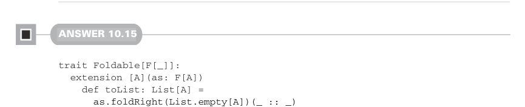
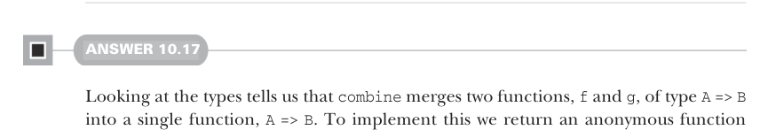

# Page 0310

[<- Page 0309](./page-0309) | [Pages index](./) | [Page 0311 ->](./page-0311)

> Part 3: Common structures in functional design / Chapter 10: Monoids / 10.9 Exercise answers

## 281 10.9 Exercise answers

```scala
case None => acc
case Some(a) => f(a, acc)
override def foldLeft[B](acc: B)(f: (B, A) => B) = as match
case None => acc
case Some(a) => f(acc, a)
override def foldMap[B](f: A => B)(using mb: Monoid[B]): B =
as match
case None => mb.empty
case Some(a) => f(a)
```



#### ANSWER 10.15

```scala
trait Foldable[F[_]]:
extension [A](as: F[A])
def toList: List[A] =
as.foldRight(List.empty[A])(_ :: _)
```

Note that we can also override this `toList` implementation in the `Foldable[List]` instance:

```scala
given Foldable[List] with
extension [A](as: List[A])
override def foldRight[B](acc: B)(f: (A, B) => B) =
as.foldRight(acc)(f)
override def foldLeft[B](acc: B)(f: (B, A) => B) =
as.foldLeft(acc)(f)
override def toList: List[A] = as
```


#### ANSWER 10.16

To implement `combine`, we combine the first element of the input pairs with `ma` and the second element with `mb`, returning the result as a pair. For `empty` we pair the empty elements of `ma` and `mb`:

```scala
given productMonoid[A, B](
using ma: Monoid[A], mb: Monoid[B]
): Monoid[(A, B)] with
def combine(x: (A, B), y: (A, B)) =
(ma.combine(x(0), y(0)), mb.combine(x(1), y(1)))
val empty = (ma.empty, mb.empty)
```



#### ANSWER 10.17

Looking at the types tells us that `combine` merges two functions, `f` and `g`, of type `A` `=>` `B` into a single function, `A` `=>` `B`. To implement this we return an anonymous function

[<- Page 0309](./page-0309) | [Pages index](./) | [Page 0311 ->](./page-0311)
