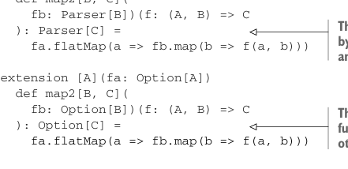

# Page 0316

[<- Page 0315](./page-0315) | [Pages index](./) | [Page 0317 ->](./page-0317)

> Part 3: Common structures in functional design / Chapter 11: Monads / 11.2 Monads: Generalizing the flatMap and unit functions / 11.2.1 The Monad trait

## 287 11.2 Monads: Generalizing the flatMap and unit functions

### 11.2 Monads: Generalizing the flatMap and unit functions

`Functor` is just one of many abstractions we can factor out of our libraries. But `Functor` isn’t too compelling, as there aren’t many useful operations that can be defined purely in terms of `map`. Next we’ll look at a more interesting interface: `Monad`. Using this interface, we can implement a number of useful operations once and for all, factoring out what would otherwise be duplicated code. And it comes with laws with which we can reason that our libraries work the way we expect. Recall that for several of the data types in this book so far, we’ve implemented `map2` to lift a function taking two arguments. For `Gen`, `Parser`, and `Option` the `map2` function could be implemented as follows.

Listing 11.1 Implementing `map2` for `Gen`, `Parser`, and `Option`


> This makes a generator of a random C that runs random generators fa and fb, combining their results with the function f.

```scala
extension [A](fa: Gen[A])
def map2[B, C](fb: Gen[B])(f: (A, B) => C): Gen[C] =
fa.flatMap(a => fb.map(b => f(a, b)))
extension [A](fa: Parser[A])
def map2[B, C](
fb: Parser[B])(f: (A, B) => C
): Parser[C] =
fa.flatMap(a => fb.map(b => f(a, b)))
```



> This makes a parser that produces C by combining the results of parsers fa and fb with the function f.

```scala
extension [A](fa: Option[A])
def map2[B, C](
fb: Option[B])(f: (A, B) => C
): Option[C] =
```

> This combines two Options with the function f when both have a value; otherwise, it returns None.

```scala
fa.flatMap(a => fb.map(b => f(a, b)))
```

These functions have more in common than just the name. In spite of operating on data types that seemingly have nothing to do with one another, the implementations are identical! The only thing that differs is the particular data type being operated on. This confirms what we’ve suspected all along—that these are individual instances of a more general pattern. We should be able to exploit that fact to avoid repeating ourselves. For example, we should be able to write `map2` once and for all in such a way that it can be reused for all of these data types. We’ve made the code duplication particularly obvious here by choosing uniform names for our functions, taking the arguments in the same order, and so on. It may be more difficult to spot in your everyday work, but the more libraries you write, the better you’ll get at identifying patterns you can factor out into common abstractions.

### 11.2.1 The Monad trait

What unites `Parser`, `Gen`, `Par`, `Option`, and many of the other data types we’ve looked at is that they’re monads. Much like we did with `Functor` and `Foldable`, we can come up with a Scala trait for `Monad` that defines `map2` and numerous other functions once and for all, rather than having to duplicate their definitions for every concrete data type.

[<- Page 0315](./page-0315) | [Pages index](./) | [Page 0317 ->](./page-0317)
