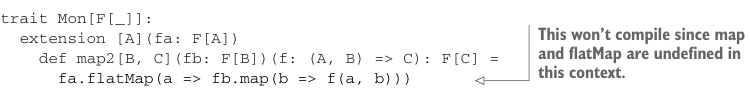

# Page 0317

[<- Page 0316](./page-0316) | [Pages index](./) | [Page 0318 ->](./page-0318)

> Part 3: Common structures in functional design / Chapter 11: Monads / 11.2 Monads: Generalizing the flatMap and unit functions / 11.2.1 The Monad trait

In part 2 of this book, we concerned ourselves with individual data types, finding a minimal set of primitive operations from which we could derive a large number of useful combinators. We’ll do the same kind of thing here to refine an *abstract* interface to a small set of primitives. Let’s start by introducing a new trait, called `Mon` for now. Since we know we want to eventually define `map2`, let’s add that.

Listing 11.2 Creating a `Mon` trait for `map2`



```scala
trait Mon[F[_]]:
extension [A](fa: F[A])
def map2[B, C](fb: F[B])(f: (A, B) => C): F[C] =
```

> This won’t compile since map and flatMap are undefined in this context.

```scala
fa.flatMap(a => fb.map(b => f(a, b)))
```

Here we’ve just taken the implementation of `map2` and changed `Parser`, `Gen`, and `Option` to the polymorphic `F` of the `Mon[F]` interface in the signature.7 But in this polymorphic context, this won’t compile! We don’t know anything about `F` here, so we certainly don’t know how to `flatMap` or `map` over an `F[A]`. Here we can simply add `map` and `flatMap` to the `Mon` interface and keep them abstract.

Listing 11.3 Adding `map` and `flatMap` to our trait

```scala
trait Mon[F[_]]:
extension [A](fa: F[A])
def map[B](f: A => B): F[B]
def flatMap[B](f: A => F[B]): F[B]
```


> We’re calling the (abstract) functions map and flatMap in the Mon interface.

```scala
def map2[B, C](fb: F[B])(f: (A, B) => C): F[C] =
fa.flatMap(a => fb.map(b => f(a, b)))
```

This translation was rather mechanical. We just inspected the implementation of `map2` and added all the functions it called, `map` and `flatMap`, as suitably abstract methods on our interface. This trait will now compile, but before we declare victory and move on to defining instances of `Mon[List]`, `Mon[Parser]`, `Mon[Option]`, and so on, let’s see if we can refine our set of primitives. Our current set of primitives is `map` and `flatMap`, from which we can derive `map2`. Are `flatMap` and `map` a minimal set of primitives? Well, the data types that implemented `map2` all had a `unit`, and we know `map` can be implemented in terms of `flatMap` and `unit`. For example, on `Gen`

```scala
def map[B](f: A => B): Gen[B] =
flatMap(a => unit(f(a)))
```

7 Our decision to call the type constructor argument `F` here was arbitrary. We could have called this argument `Foo`, `w00t`, or `Blah2`, though by convention, we usually give type constructor arguments one-letter uppercase names, such as `F`, `G`, and `H` or sometimes `M` and `N` or `P` and `Q`.

[<- Page 0316](./page-0316) | [Pages index](./) | [Page 0318 ->](./page-0318)
