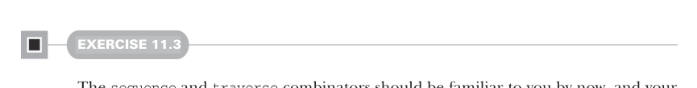

# Page 0319

[<- Page 0318](./page-0318) | [Pages index](./) | [Page 0320 ->](./page-0320)

> Part 3: Common structures in functional design / Chapter 11: Monads / 11.3 Monadic combinators


#### EXERCISE 11.2

*Hard*: `State` looks like it would be a monad too, but it takes two type arguments, and you need a type constructor of one argument to implement `Monad`. Try to implement a `State` monad, see what problems you run into, and think about possible solutions. We’ll discuss the solution later in this chapter.

### 11.3 Monadic combinators

Now that we have our primitives for monads, we can look back at previous chapters and see if there were some other functions we implemented for each of our monadic data types. Many of them can be implemented once for all monads, so let’s do that now.



#### EXERCISE 11.3

The `sequence` and `traverse` combinators should be familiar to you by now, and your implementations of them from various prior chapters are probably all very similar. Implement them once and for all on `Monad[F]`:

```scala
def sequence[A](fas: List[F[A]]): F[List[A]]
def traverse[A,B](as: List[A])(f: A => F[B]): F[List[B]]
```

One combinator we saw for `Gen` and `Parser` was `listOfN`, which allowed us to replicate a parser or generator `n` times to get a parser or generator of lists of that length. We can implement this combinator for all monads `F` by adding it to our `Monad` trait. We should also give it a more generic name, such as `replicateM` (meaning *replicate in* *a monad*).


#### EXERCISE 11.4

Implement `replicateM`:

```scala
def replicateM[A](n: Int, fa: F[A]): F[List[A]]
```

[<- Page 0318](./page-0318) | [Pages index](./) | [Page 0320 ->](./page-0320)
