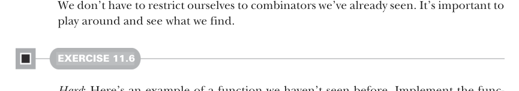

# Page 0320

[<- Page 0319](./page-0319) | [Pages index](./) | [Page 0321 ->](./page-0321)

> Part 3: Common structures in functional design / Chapter 11: Monads / 11.4 Monad laws

## 291 11.4 Monad laws


#### EXERCISE 11.5

Think about how `replicateM` will behave for various choices of `F`. For example, how does it behave in the `List` monad? What about `Option`? Describe in your own words the general meaning of `replicateM`.

There was also a combinator for our `Gen` data type, `product`, to take two generators and turn them into a generator of pairs, and we did the same thing for `Par` computations. In both cases, we implemented `product` in terms of `map2`, so we can definitely write it generically for any monad `F`:

```scala
extension [A](fa: F[A]) def product[B](fb: F[B]): F[(A, B)] =
fa.map2(mb)((_, _))
```



We don’t have to restrict ourselves to combinators we’ve already seen. It’s important to play around and see what we find.

#### EXERCISE 11.6

*Hard*: Here’s an example of a function we haven’t seen before. Implement the function `filterM`—it’s a bit like `filter`, except instead of a function from `A` `=>` `Boolean`, we have an `A` `=>` `F[Boolean]`. (Replacing various ordinary functions like this with the monadic equivalent often yields interesting results.) Implement this function, and then think about what it means for various data types:

```scala
def filterM[A](as: List[A])(f: A => F[Boolean]): F[List[A]]
```

The combinators we’ve seen here are only a small sample of the full library that `Monad` lets us implement once and for all. We’ll see some more examples in chapter 13.

### 11.4 Monad laws

In this section, we’ll introduce laws to govern our `Monad` interface.8 Certainly, we’d expect the functor laws to also hold for `Monad`, since a `Monad[F]`*is* a `Functor[F]`, but what else do we expect? What laws should constrain `flatMap` and `unit`?

8 These laws, once again, come from the concept of monads from category theory, but a background in category theory isn’t necessary to understand this section.

[<- Page 0319](./page-0319) | [Pages index](./) | [Page 0321 ->](./page-0321)
