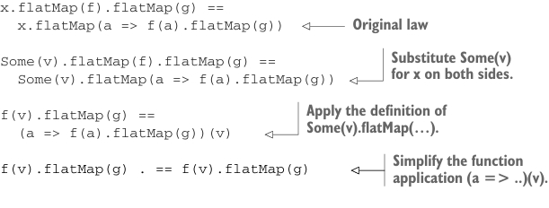

# Page 0322

[<- Page 0321](./page-0321) | [Pages index](./) | [Page 0323 ->](./page-0323)

> Part 3: Common structures in functional design / Chapter 11: Monads / 11.4 Monad laws / 11.4.2 Proving the associative law for a specific monad

## 293 11.4 Monad laws

```scala
Gen.nextString.flatMap(name =>
Gen.nextInt.map(price =>
Item(name, price))
).flatMap(item =>
Gen.nextInt.map(quantity =>
Order(item, quantity)))
```

Once we expand them, it’s clear those two implementations aren’t identical. And yet when we look at the for-comprehension it seems perfectly reasonable to assume the two implementations do exactly the same thing. In fact, it would be surprising and weird if they didn’t. This is because we’re assuming `flatMap` obeys an associative law:

```scala
x.flatMap(f).flatMap(g) == x.flatMap(a => f(a).flatMap(g))
```

And this law should hold for all values `x`, `f`, and `g` of the appropriate types—not just for `Gen`, but for `Parser`, `Option`, and any other monad.

### 11.4.2 Proving the associative law for a specific monad

Let’s prove this law holds for `Option`. All we have to do is substitute `None` or `Some(v)` for `x` in the preceding equation and expand both sides of it. We start with the case in which `x` is `None`, and then both sides of the equal sign are `None`:

```scala
None.flatMap(f).flatMap(g) == None.flatMap(a => f(a).flatMap(g))
```

Since `None.flatMap(f)` is `None` for all `f`, this simplifies to

```scala
None == None
```

Thus the law holds if `x` is `None`. What about if `x` is `Some(v)` for an arbitrary choice of `v`? In that case, we have

```scala
x.flatMap(f).flatMap(g) ==
x.flatMap(a => f(a).flatMap(g))
```



> Original law

> Substitute Some(v) for x on both sides.

```scala
Some(v).flatMap(f).flatMap(g) ==
Some(v).flatMap(a => f(a).flatMap(g))
```

> Apply the definition of Some(v).flatMap(…).

```scala
f(v).flatMap(g) ==
(a => f(a).flatMap(g))(v)
```

> Simplify the function application (a =>..)(v).

```scala
f(v).flatMap(g) . == f(v).flatMap(g)
```

Thus the law also holds when `x` is `Some(v)` for any `v`. We’re now done, as we’ve shown that the law holds when `x` is `None` or `Some`, and these are the only two possibilities for `Option`.

[<- Page 0321](./page-0321) | [Pages index](./) | [Page 0323 ->](./page-0323)
