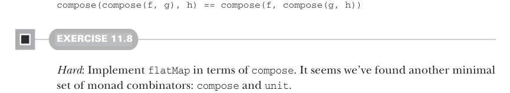
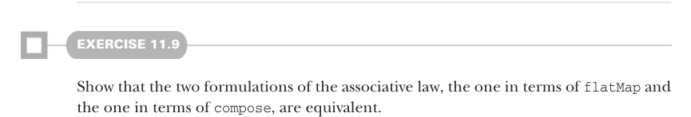

# Page 0323

[<- Page 0322](./page-0322) | [Pages index](./) | [Page 0324 ->](./page-0324)

> Part 3: Common structures in functional design / Chapter 11: Monads / 11.4 Monad laws / 11.4.3 The identity laws

KLEISLI COMPOSITION: A CLEARER VIEW OF THE ASSOCIATIVE LAW It’s not so easy to see that the law we just discussed is an associative law. Remember the associative law for monoids? That was clear:

```scala
combine(combine(x, y), z) == combine(x, combine(y, z))
```

But our associative law for monads doesn’t look anything like that! Fortunately, there’s a way we can make the law clearer if we consider not the monadic values of types like `F[A]` but monadic functions of types like `A` `=>` `F[B]`. Functions like that are called *Kleisli arrows*,9 and they can be composed with one another:


```scala
def compose[A, B, C](f: A => F[B], g: B => F[C]): A => F[C]
```

#### EXERCISE 11.7

Implement the Kleisli composition function `compose`.

We can now state the associative law for monads in a much more symmetric way:



```scala
compose(compose(f, g), h) == compose(f, compose(g, h))
```

#### EXERCISE 11.8

*Hard*: Implement `flatMap` in terms of `compose`. It seems we’ve found another minimal set of monad combinators: `compose` and `unit`.



#### EXERCISE 11.9

Show that the two formulations of the associative law, the one in terms of `flatMap` and the one in terms of `compose`, are equivalent.

### 11.4.3 The identity laws

The other monad law is now pretty easy to see. Just like `empty` was an *identity element* for `combine` in a monoid, there’s an identity element for `compose` in a monad. Indeed, that’s exactly what `unit` is, and that’s why we chose this name for this operation:10


```scala
def unit[A](a: => A): F[A]
```

9* Kleisli arrow* comes from category theory and is named after the Swiss mathematician Heinrich Kleisli. 10The name *unit* is often used in mathematics to mean an identity for some operation.

[<- Page 0322](./page-0322) | [Pages index](./) | [Page 0324 ->](./page-0324)
