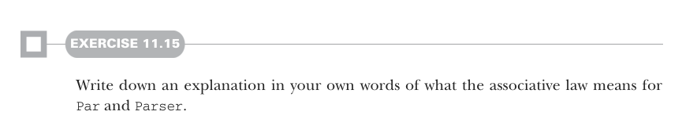
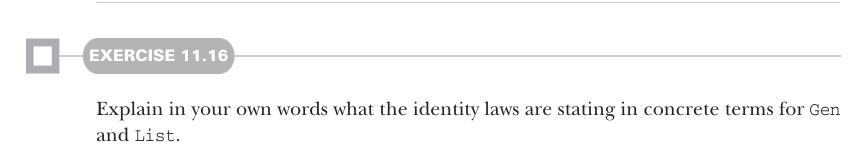

# Page 0325

[<- Page 0324](./page-0324) | [Pages index](./) | [Page 0326 ->](./page-0326)

> Part 3: Common structures in functional design / Chapter 11: Monads / 11.5 Just what is a monad?

#### EXERCISE 11.15

Write down an explanation in your own words of what the associative law means for `Par` and `Parser`.

#### EXERCISE 11.16

Explain in your own words what the identity laws are stating in concrete terms for `Gen` and `List`.

### 11.5 Just what is a monad?

Let’s now take a wider perspective. There’s something unusual about the `Monad` interface: the data types for which we’ve given monad instances don’t seem to have much to do with each other. Yes, `Monad` factors out code duplication among them, but what is a monad exactly? What does monad mean? You may be used to thinking of interfaces as providing a relatively complete API for an abstract data type, merely abstracting over the specific representation. After all, a singly linked list and an array-based list may be implemented differently behind the scenes, but they’ll share a common interface in terms that lots of useful and concrete application code can be written. `Monad`, like `Monoid`, is a more abstract, purely algebraic interface. The `Monad` combinators are often just a small fragment of the full API for a given data type that happens to be a monad. So `Monad` doesn’t generalize one type or another; rather, many vastly different data types can satisfy the `Monad` interface and laws. We’ve seen three minimal sets of primitive `Monad` combinators, and instances of `Monad` will have to provide implementations of one of these sets:

 `unit` and `flatMap`

 `unit` and `compose`

 `unit`, `map`, and `join`

And we know there are two monad laws to be satisfied, associativity and identity, that can be formulated in various ways. So we can state plainly what a monad is:

*A monad is an implementation of one of the minimal sets of monadic combinators,* *satisfying the laws of associativity and identity.*

That’s a perfectly respectable, precise, and terse definition. And if we’re being precise, this is the only correct definition. A monad is precisely defined by its operations and laws—no more, no less. But it’s a little unsatisfying. It doesn’t say much about what it implies—what a monad means. The problem is that it’s a self-contained definition. Even

[<- Page 0324](./page-0324) | [Pages index](./) | [Page 0326 ->](./page-0326)
