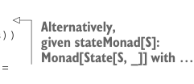

# Page 0328

[<- Page 0327](./page-0327) | [Pages index](./) | [Page 0329 ->](./page-0329)

> Part 3: Common structures in functional design / Chapter 11: Monads / 11.5 Just what is a monad? / 11.5.2 The State monad and partial type application

## 299 11.5 Just what is a monad?

Of course, it would be really repetitive if we had to manually write a separate `Monad` instance for each state type. Fortunately, Scala allows us to create anonymous type constructors. For example, we could have declared `IntState` directly inline like this:

```scala
given intStateMonad: Monad[[x] =>> State[Int, x]] with ...
```

This defines a monad for the anonymous type constructor `[x]` `=>>` `State[Int,` `x]`—a type constructor that takes a single argument of type `x` and returns the type `State[Int,` `x]`. You can think of this as the type-level equivalent of anonymous functions. And just like anonymous functions have an abbreviated form (e.g., `_` `+` `1` instead of `x` `=>` `x` `+` `1`), anonymous type constructors do too. With the `-Ykind-projector:underscores` compiler option enabled, we can rewrite `[x]` `=>>` `State[Int,` `x]` as `State[Int,` `_]`.12

An anonymous type constructor declared inline like this is called a *type lambda* in Scala. We can use this feature to partially apply the `State` type constructor and declare a monad instance for any state type `S`:



```scala
given stateMonad[S]: Monad[[x] =>> State[S, x]] with
def unit[A](a: => A): State[S,A] = State(s => (a, s))
extension [A](st: State[S, A])
def flatMap[B](f: A => State[S, B]): State[S, B] =
```

> Alternatively, given stateMonad[S]: Monad[State[S, _]] with …

```scala
State.flatMap(st)(f)
```


Again, just by giving implementations of `unit` and `flatMap`, we get implementations of all the other monadic combinators for free.

#### EXERCISE 11.18

Now that we have a `State` monad, we should try it out to see how it behaves. What is the meaning of `replicateM` in the `State` monad? How does `map2` behave? What about `sequence`?

Let’s now look at the difference between the `Id` monad and the `State` monad. Remember that the primitive operations on `State` (besides the monadic operations `unit` and `flatMap`) are that we can read the current state with `get`, and we can set a new state with `set`:

```scala
def get[S]: State[S, S]
def set[S](s: => S): State[S, Unit]
```


Remember that we also discovered that these combinators constitute a minimal set of primitive operations for `State`. So together with the monadic primitives (`unit` and

12Anonymous type constructors are a Scala 3 feature inspired by so-called *type lambdas* from Scala 2. Type lambdas weren’t an intentional language feature but rather a pattern that was discovered and then codified in the popular kind-projector compiler plugin.

[<- Page 0327](./page-0327) | [Pages index](./) | [Page 0329 ->](./page-0329)
