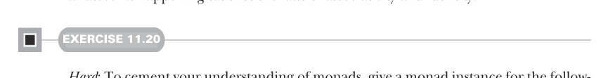

# Page 0330

[<- Page 0329](./page-0329) | [Pages index](./) | [Page 0331 ->](./page-0331)

> Part 3: Common structures in functional design / Chapter 11: Monads / 11.6 Conclusion

## 301 Summary

With the `Option` monad, a statement may return `None` and terminate the program. With the `List` monad, a statement may return many results, which causes statements that follow it to potentially run multiple times—once for each result. The `Monad` contract doesn’t specify what is happening between the lines, only that whatever *is* happening satisfies the laws of associativity and identity.



#### EXERCISE 11.20

*Hard*: To cement your understanding of monads, give a monad instance for the following type, and explain what it means. What are its primitive operations? What is the action of `flatMap`? What meaning does it give to monadic functions like `sequence`, `join`, and `replicateM`? What meaning does it give to the monad laws?14

```scala
opaque type Reader[-R, +A] = R => A
object Reader:
given readerMonad[R]: Monad[Reader[R, _]] with
def unit[A](a: => A): Reader[R, A] =
???
extension [A](fa: Reader[R, A])
override def flatMap[B](f: A => Reader[R, B]) =
???
```

### 11.6 Conclusion

In this chapter, we took a pattern we’ve seen repeated throughout the book and unified it under a single concept: the monad. This allowed us to write a number of combinators once and for all for many different data types that, at first glance, don’t seem to have anything in common. We discussed laws they all satisfy, the monad laws, from various perspectives, and we developed some insight into what it all means. An abstract topic like this can’t be fully understood all at once. It requires an iterative approach through which we keep revisiting the topic from different perspectives. When we discover new monads, discover new applications of them, or see them appear in a new context, we’ll inevitably gain new insight. And each time it happens, you might think to yourself, OK, I thought I understood monads before, but now I *really* get it.

### Summary

A functor is an implementation of `map` that preserves the structure of the data type.

The functor laws are – Identity: `x.map(a` `=>` `a)` `==` `x` – Composition: `x.map(f).map(g)` `==` `x.map(f` `andThen` `g)`

14See the chapter notes (https://github.com/fpinscala/fpinscala/wiki) for further discussion of this data type.

[<- Page 0329](./page-0329) | [Pages index](./) | [Page 0331 ->](./page-0331)
