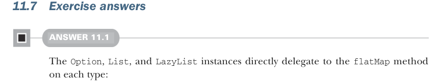

# Page 0331

[<- Page 0330](./page-0330) | [Pages index](./) | [Page 0332 ->](./page-0332)

> Part 3: Common structures in functional design / Chapter 11: Monads / 11.7 Exercise answers

A monad is an implementation of one of the minimal sets of monadic combinators, satisfying the laws of associativity and identity.

The minimal sets of monadic combinators are –`unit` and `flatMap` –`unit` and `compose` –`unit`, `map`, and `join`

The monad laws are –* Associativity*—`x.flatMap(f).flatMap(g)` `==` `x.flatMap(a` `=>` `f(a).flat-` `Map(g))` –* Right identity*—`x.flatMap(unit)` `==` `x` –* Left identity*—`unit(y).flatMap(f)` `==` `f(y)`

All monads are functors, but not all functors are monads.

There are monads for many of the data types encountered in this book, including `Option`, `List`, `LazyList`, `Par`, and `State[S,` `_]`.

The `Monad` contract doesn’t specify what is happening between the lines, only that whatever is happening satisfies the laws of associativity and identity.

Providing a `Monad` instance for a type constructor has practical usefulness. Doing so gives access to all of the derived operations (or combinators) in exchange for implementing one of the minimal sets of monadic combinators.



### 11.7 Exercise answers

#### ANSWER 11.1

The `Option`, `List`, and `LazyList` instances directly delegate to the `flatMap` method on each type:

```scala
given optionMonad: Monad[Option] with
def unit[A](a: => A) = Some(a)
extension [A](fa: Option[A])
override def flatMap[B](f: A => Option[B]) =
fa.flatMap(f)
given listMonad: Monad[List] with
def unit[A](a: => A) = List(a)
extension [A](fa: List[A])
override def flatMap[B](f: A => List[B]) =
fa.flatMap(f)
given lazyListMonad: Monad[LazyList] with
def unit[A](a: => A) = LazyList(a)
extension [A](fa: LazyList[A])
override def flatMap[B](f: A => LazyList[B]) =
fa.flatMap(f)
```

Recall that `Par` is an opaque type alias that has a `flatMap` method defined via an extension method. We have to be careful to tell Scala that we want the `flatMap` extension

[<- Page 0330](./page-0330) | [Pages index](./) | [Page 0332 ->](./page-0332)
