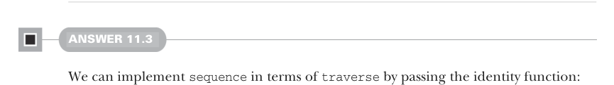

# Page 0332

[<- Page 0331](./page-0331) | [Pages index](./) | [Page 0333 ->](./page-0333)

> Part 3: Common structures in functional design / Chapter 11: Monads / 11.7 Exercise answers

## 303 11.7 Exercise answers

method defined in the `Par` companion and not the one we’re defining on `Monad` (or else we’d have an infinite loop, where `flatMap` just calls itself until we exhaust the stack):

```scala
given parMonad: Monad[Par] with
def unit[A](a: => A) = Par.unit(a)
extension [A](fa: Par[A])
override def flatMap[B](f: A => Par[B]): Par[B] =
Par.flatMap(fa)(f)
```

Defining a `Monad` instance for a parser is a bit syntactically trickier due to the `Parsers` trait. One solution is defining a function that provides a `Monad[P]` instance, given a value of type `Parsers[P]`:

```scala
def parserMonad[P[+_]](p: Parsers[P]): Monad[P] = new:
def unit[A](a: => A) = p.succeed(a)
extension [A](fa: P[A])
override def flatMap[B](f: A => P[B]): P[B] =
p.flatMap(fa)(f)
```


#### ANSWER 11.2

The `State` type constructor takes two type parameters, but `Monad` requires a type constructor of a single type parameter. We can create a type alias that takes a single type parameter and pick an arbitrary type for `S`:

```scala
type IntState[A] = State[Int, A]
```

Here we chose `Int` for the `S` type parameter, but we could have chosen anything. With this type alias, we can define a `Monad[IntState]` instance:

```scala
given stateIntMonad: Monad[StateInt] with
def unit[A](a: => A) = State(s => (a, s))
extension [A](fa: StateInt[A])
override def flatMap[B](f: A => StateInt[B]) =
State.flatMap(fa)(f)
```

Our implementation didn’t take advantage of the fact that we instantiated `State` with `S` `=` `Int`. This is a good clue that we can define a monad for any choice of `S`. Later in this chapter, we’ll see how to accomplish that.



#### ANSWER 11.3

We can implement `sequence` in terms of `traverse` by passing the identity function:

```scala
def sequence[A](fas: List[F[A]]): F[List[A]] =
traverse(fas)(identity)
```

[<- Page 0331](./page-0331) | [Pages index](./) | [Page 0333 ->](./page-0333)
