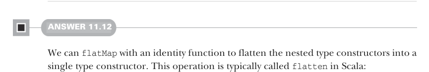
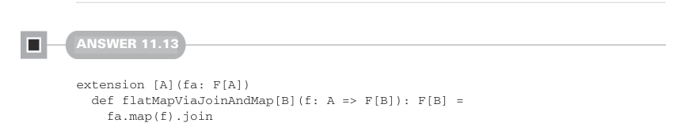

# Page 0337

[<- Page 0336](./page-0336) | [Pages index](./) | [Page 0338 ->](./page-0338)

> Part 3: Common structures in functional design / Chapter 11: Monads / 11.7 Exercise answers


Now let’s prove `compose(unit,` `f)` `==` `f` is equivalent to `unit(y).flatMap(f)` `==` `f(y)`:

> Substitute compose with the definition.

> Apply y to both sides.

```scala
compose(unit, f)
== f
a => unit(a).flatMap(f)
== f
(a => unit(a).flatMap(f))(y) == f(y)
unit(y).flatMap(f)
== f(y)
```

> Simplify the left-hand side by substituting a with y.

#### ANSWER 11.11

Let’s prove that the identity laws hold for `Option`. As a reminder, the definition of `flatMap` on `Option` is

```scala
enum Option[+A]:
case Some(get: A)
case None
def flatMap[B](f: A => Option[B]): Option[B] =
this match
case None => None
case Some(a) => f(a)
```

Let’s first prove `compose(f,` `unit)` `==` `f`; recall that this law is equivalent to `x.flatMap` `(unit)` `==` `x`. When `x` is `None`, the left-hand side reduces to `None` by the definition of `flatMap`. When `x` is `Some(a)`, it reduces to `unit(a)`, and `unit(a)` reduces to `Some(a)`. Now let’s prove that `compose(unit,` `f)` `==` `f`; this is equivalent to `unit(y).flat-` `Map(f)` `==` `f(y)`. Using the definition of `unit`, the left-hand side simplifies to `Some(y).flatMap(f)`. Using the definition of `flatMap`, that simplifies to `f(y)`.



#### ANSWER 11.12

We can `flatMap` with an identity function to flatten the nested type constructors into a single type constructor. This operation is typically called `flatten` in Scala:

```scala
extension [A](ffa: F[F[A]]) def join: F[A] =
ffa.flatMap(identity)
```



#### ANSWER 11.13

```scala
extension [A](fa: F[A])
def flatMapViaJoinAndMap[B](f: A => F[B]): F[B] =
fa.map(f).join
```

[<- Page 0336](./page-0336) | [Pages index](./) | [Page 0338 ->](./page-0338)
