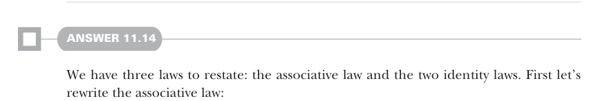

# Page 0338

[<- Page 0337](./page-0337) | [Pages index](./) | [Page 0339 ->](./page-0339)

> Part 3: Common structures in functional design / Chapter 11: Monads / 11.7 Exercise answers

## 309 11.7 Exercise answers

```scala
def composeViaJoinAndMap[A, B, C](f: A => F[B], g: B => F[C]): A => F[C] =
a => f(a).map(g).join
```



#### ANSWER 11.14

We have three laws to restate: the associative law and the two identity laws. First let’s rewrite the associative law:

```scala
x.flatMap(f).flatMap(g) ==
x.flatMap(a => f(a).flatMap(g))
```


> Substitute all uses of flatMap(h) with map(h).join. Choose f = identity, and simplify using the functor law that x.map(identity) = x.

```scala
x.map(f).join.map(g).join ==
x.map(a => f(a).map(g).join).join
x.join.map(g).join == x.map(a => a.map(g).join).join
```

> Choose g = identity, and simplify.

```scala
x.join.join == x.map(a => a.join).join
```

> Use lambda on the right-hand side.

```scala
x.join.join == x.map(_.join).join
```

Next let’s rewrite the right identity law (using the version expressed in terms of `flatMap`):


```scala
x.flatMap(unit)
== x
x.map(unit).join == x
```

> Substitute the definition of flatMap.

Finally, let’s rewrite the left identity law:

```scala
unit(y).flatMap(f)
== f(y)
unit(y).map(f).join == f(y)
unit(y).join
== y
```

> Substitute the definition of flatMap.

> Choose f = identity, and simplify.

#### ANSWER 11.15

Let’s use the `join` version of the associative law: `x.join.join` `==` `x.map(_.join).join`. Note that `x` has the `F[F[F[A]]]` type here. For `Par`, the associative law says that if you have a three-level deep parallel computation, you can await the results of the computations inside out or outside in, and the result is equivalent. For `Parser`, the associative law says that in a series of dependent parsers, only the order of the parsers matters, not the way in which they are nested.

[<- Page 0337](./page-0337) | [Pages index](./) | [Page 0339 ->](./page-0339)
