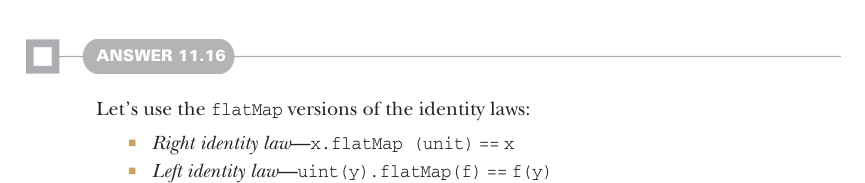
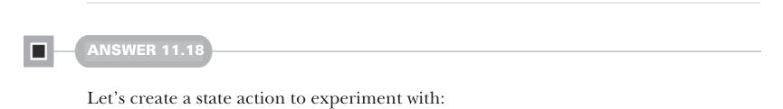

# Page 0339

[<- Page 0338](./page-0338) | [Pages index](./) | [Page 0340 ->](./page-0340)

> Part 3: Common structures in functional design / Chapter 11: Monads / 11.7 Exercise answers



#### ANSWER 11.16

Let’s use the `flatMap` versions of the identity laws:

*Right identity law*—`x.flatMap (unit)` `==` `x`

*Left identity law*—`uint(y).flatMap(f)` `==` `f(y)`

For `Gen`, the right identity law means that flat mapping the unit generator over a generator doesn’t change it in any way. The left identity law means that the generator you get from lifting an arbitrary value via the unit generator and then flat mapping that over an arbitrary function is equivalent to simply applying that value directly to the function. Travelling through the unit generator and `flatMap` has no effect on the generated values. For `List`, the right identity law means that flat mapping a singleton list constructor over each element results in the original list—that `flatMap` can’t drop, filter, or otherwise change the elements. The left identity law means that `flatMap` can’t increase or decrease the number of elements (e.g., by applying the supplied function multiple times to each element before joining the results).


#### ANSWER 11.17

```scala
case class Id[+A](value: A):
def map[B](f: A => B): Id[B] =
Id(f(value))
def flatMap[B](f: A => Id[B]): Id[B] =
f(value)
object Id:
given idMonad: Monad[Id] with
def unit[A](a: => A) = Id(a)
extension [A](fa: Id[A])
override def flatMap[B](f: A => Id[B]) =
fa.flatMap(f)
```



#### ANSWER 11.18

Let’s create a state action to experiment with:

```scala
val getAndIncrement: State[Int, Int] =
for
i <- State.get
_ <- State.set(i + 1)
yield i
```

[<- Page 0338](./page-0338) | [Pages index](./) | [Page 0340 ->](./page-0340)
