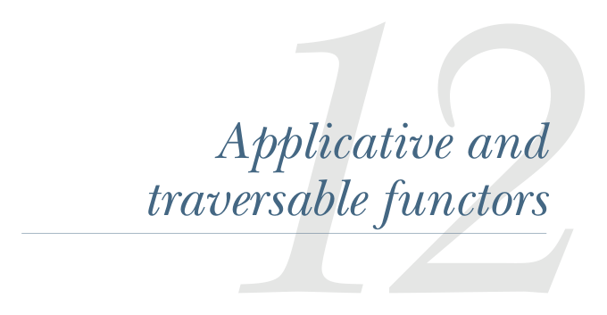
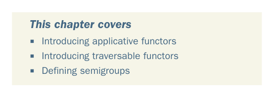

# Page 0342

[<- Page 0341](./page-0341) | [Pages index](./) | [Page 0343 ->](./page-0343)

> Part 3: Common structures in functional design / Chapter 12: Applicative and traversable functors

## Applicative and traversable functors

### This chapter covers

Introducing applicative functors

Introducing traversable functors

Defining semigroups

In the previous chapter on monads, we saw how many of the functions we’ve been writing for different combinator libraries can be expressed in terms of a single interface: `Monad`. Monads provide a powerful interface, as evidenced by the fact that we can use `flatMap` to essentially write imperative programs in a purely functional way. In this chapter, we’ll learn about a type of related abstractions, *applicative func-*tors*, which are less powerful than monads but more general (and hence more common). The process of arriving at applicative functors will also provide some insight into how to discover such abstractions, and we’ll use some of these ideas to uncover another useful abstraction: *traversable functors*. It may take some time for the full significance and usefulness of these abstractions to sink in, but you’ll see them popping up again and again in your daily work with FP if you pay attention.

**313**

[<- Page 0341](./page-0341) | [Pages index](./) | [Page 0343 ->](./page-0343)
