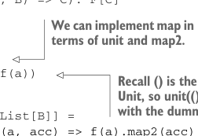

# Page 0343

[<- Page 0342](./page-0342) | [Pages index](./) | [Page 0344 ->](./page-0344)

> Part 3: Common structures in functional design / Chapter 12: Applicative and traversable functors / 12.2 The Applicative trait

### 12.1 Generalizing monads By now we’ve seen various operations, like sequence and traverse, implemented many times for different monads, and in the last chapter, we generalized the implementations to work for any monad F:

```scala
def sequence[A](fas: List[F[A]]): F[List[A]]
traverse(fas)(fa => fa)
def traverse[A, B](as: List[A])(f: A => F[B]): F[List[B]]
as.foldRight(unit(List[B]()))((a, acc) => f(a).map2(acc)(_ :: _))
```

Here the implementation of `traverse` is using `map2` and `unit`, and we’ve seen that `map2` can be implemented in terms of `flatMap`:

```scala
extension [A](fa: F[A])
def map2[B, C](fb: F[B])(f: (A, B) => C): F[C] =
fa.flatMap(a => fb.map(b => f(a, b)))
```

You may not have noticed that a large number of the useful combinators on `Monad` can be defined using only `unit` and `map2`. The `traverse` combinator is one example—it doesn’t call `flatMap` directly and is therefore agnostic to whether `map2` is primitive or derived. Furthermore, for many data types, `map2` can be implemented directly, without using `flatMap`. All this suggests a variation on `Monad`—the `Monad` interface has `flatMap` and `unit` as primitives and derives `map2`, but we can obtain a different abstraction by letting `unit` and `map2` be the primitives. We’ll see that this new abstraction, called an *applica-*tive functor*, is less powerful than a monad, but we’ll also see that limitations come with benefits.

### 12.2 The Applicative trait Applicative functors can be captured by a new interface, Applicative, in which unit and map2 are primitives.

Listing 12.1 Creating the `Applicative` interface

```scala
trait Applicative[F[_]] extends Functor[F]:
// primitive combinators
def unit[A](a: => A): F[A]
extension [A](fa: F[A])
def map2[B, C](fb: F[B])(f: (A, B) => C): F[C]
```



> We can implement map in terms of unit and map2.

```scala
// derived combinators
extension [A](fa: F[A])
def map[B](f: A => B): F[B] =
fa.map2(unit(()))((a, _) => f(a))
```

> The definition of traverse is identical.

> Recall () is the sole value of type Unit, so unit(()) is calling unit with the dummy value ().

```scala
def traverse[A, B](
as: List[A])(f: A => F[B]): F[List[B]] =
as.foldRight(unit(List[B]()))((a, acc) => f(a).map2(acc)(_ :: _))
```

[<- Page 0342](./page-0342) | [Pages index](./) | [Page 0344 ->](./page-0344)
