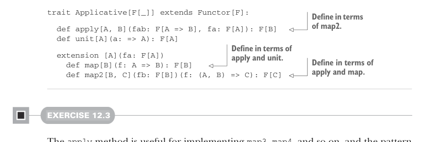

# Page 0344

[<- Page 0343](./page-0343) | [Pages index](./) | [Page 0345 ->](./page-0345)

> Part 3: Common structures in functional design / Chapter 12: Applicative and traversable functors / 12.2 The Applicative trait

## 315 12.2 The Applicative trait

This establishes that all applicatives are functors. We implement `map` in terms of `map2` and `unit`, as we’ve done before for particular data types. The implementation is suggestive of laws for `Applicative` that we’ll examine later, since we expect this implementation of `map` to preserve structure, as dictated by the `Functor` laws. Note that the implementation of `traverse` is unchanged. We can similarly move other combinators into `Applicative` that don’t depend directly on `flatMap` or `join`.


#### EXERCISE 12.1

Move the implementations of `sequence`, `traverse`, `replicateM`, and `product` from `Monad` to `Applicative`, using only `map2` and `unit` or methods implemented in terms of them:

```scala
def sequence[A](fas: List[F[A]]): F[List[A]]
def traverse[A,B](as: List[A])(f: A => F[B]): F[List[B]]
def replicateM[A](n: Int, fa: F[A]): F[List[A]]
extension [A](fa: F[A]) def product[B](fb: F[B]): F[(A, B)]
```


#### EXERCISE 12.2

*Hard*: The name *applicative* comes from the fact that we can formulate the `Applicative` interface using an alternate set of primitives, `unit` and the function `apply`, rather than `unit` and `map2`. Show that this formulation is equivalent in expressiveness by defining `map2` and `map` in terms of `unit` and `apply`. Also establish that `apply` can be implemented in terms of `map2` and `unit`:



```scala
trait Applicative[F[_]] extends Functor[F]:
```

> Define in terms of map2.

```scala
def apply[A, B](fab: F[A => B], fa: F[A]): F[B]
def unit[A](a: => A): F[A]
```

> Define in terms of apply and unit. Define in terms of apply and map.

```scala
extension [A](fa: F[A])
def map[B](f: A => B): F[B]
def map2[B, C](fb: F[B])(f: (A, B) => C): F[C]
```

#### EXERCISE 12.3

The `apply` method is useful for implementing `map3`, `map4`, and so on, and the pattern is straightforward. Implement `map3` and `map4` using only `unit`, `apply`, and the `curried` method available on functions:1

1 Recall that given `f:` `(A,` `B)` `=>` `C,` `f.curried` has type `A` `=>` `B` `=>` `C`. A `curried` method exists for functions of any arity in Scala.

[<- Page 0343](./page-0343) | [Pages index](./) | [Page 0345 ->](./page-0345)
