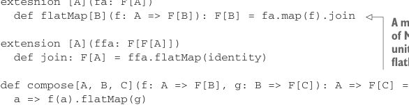

# Page 0345

[<- Page 0344](./page-0344) | [Pages index](./) | [Page 0346 ->](./page-0346)

> Part 3: Common structures in functional design / Chapter 12: Applicative and traversable functors / 12.2 The Applicative trait

```scala
extension [A](fa: F[A])
def map3[B, C, D](
fb: F[B],
fc: F[C])(f: (A, B, C) => D): F[D]
def map4[B, C, D, E](
fb: F[B],
fc: F[C],
fd: F[D])(f: (A, B, C, D) => E): F[E]
```

We could define `map3` and `map4` as regular methods instead of extension methods (e.g., `def` `map3[A,` `B,` `C,` `D](fa:` `F[A],` `fb:` `F[B],` `fc:` `F[C])(f:` `(A,` `B,` `C)` `=>` `D):` `F[D]`). One disadvantage of doing so is that call sites become more verbose. For example, with `map3` defined as a regular method on the `Applicative` trait, summing three `Option[Int]` values is `summon[Applicative[Option]].map3(oa,` `ob,` `oc)(_` `+` `_` `+` `_)` instead of `oa.map3(ob,` `oc)(_` `+` `_` `+` `_)`, with `map3` as an extension method. In the extension method case, Scala searches for a `map3` extension method for an `Option[Int]` and finds one on the `Applicative[Option]` given. There’s no need to even mention `Applicative`.

Furthermore, we can now make `Monad[F]` a subtype of `Applicative[F]` by providing the default implementation of `map2` in terms of `flatMap`. This tells us that all monads are applicative functors, and we don’t need to provide separate `Applicative` instances for all our data types that are already monads.

Listing 12.2 Making `Monad` a subtype of `Applicative`

```scala
trait Monad[F[_]] extends Applicative[F]:
extesnion [A](fa: F[A])
def flatMap[B](f: A => F[B]): F[B] = fa.map(f).join
```



> A minimal implementation of Monad must implement unit and override either flatMap or join and map.

```scala
extension [A](ffa: F[F[A]])
def join: F[A] = ffa.flatMap(identity)
def compose[A, B, C](f: A => F[B], g: B => F[C]): A => F[C] =
a => f(a).flatMap(g)
extension [A](fa: F[A])
def map[B](f: A => B): F[B] =
fa.flatMap(a => unit(f(a)))
def map2[B,C](fb: F[B])(f: (A, B) => C): F[C] =
fa.flatMap(a => fb.map(b => f(a, b)))
```

So far we’ve just rearranged the functions of our API and followed the type signatures. Let’s take a step back to understand the difference in expressiveness between `Monad` and `Applicative` and what it all means.

[<- Page 0344](./page-0344) | [Pages index](./) | [Page 0346 ->](./page-0346)
