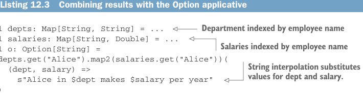

# Page 0346

[<- Page 0345](./page-0345) | [Pages index](./) | [Page 0347 ->](./page-0347)

> Part 3: Common structures in functional design / Chapter 12: Applicative and traversable functors / 12.3 The difference between monads and applicative functors / 12.3.1 The Option applicative versus the Option monad

## 317 12.3 The difference between monads and applicative functors

### 12.3 The difference between monads and applicative functors

In the last chapter, we noted there were several minimal sets of operations that defined a `Monad`:

 `unit` and `flatMap`

 `unit` and `compose`

 `unit`, `map`, and `join`

Are the `Applicative` operations `unit` and `map2` yet another minimal set of operations for monads? No. There are monadic combinators, such as `join` and `flatMap`, that can’t be implemented with just `map2` and `unit`. To see convincing proof of this, take a look at `join`:

```scala
extension [A](ffa: F[F[A]])
def join: F[A]
```

Just reasoning algebraically, we can see that `unit` and `map2` have no hope of implementing this function. The `join` function removes a layer of `F`. But the `unit` function only lets us add an `F` layer, and `map2` lets us apply a function within `F` but does no flattening of layers. By the same argument, we can see that `Applicative` has no means of implementing `flatMap` either. So `Monad` is clearly adding some extra capabilities beyond `Applicative`. But what exactly? Let’s look at some concrete examples.

### 12.3.1 The Option applicative versus the Option monad

Suppose we’re using `Option` to work with the results of lookups in two `Map` objects. If we simply need to combine the results from two (independent) lookups, then `map2` is fine.

Listing 12.3 Combining results with the Option applicative



> Department indexed by employee name

```scala
val depts: Map[String, String] = ...
val salaries: Map[String, Double] = ...
val o: Option[String] =
depts.get("Alice").map2(salaries.get("Alice"))(
(dept, salary) =>
s"Alice in $dept makes $salary per year"
)
```

> Salaries indexed by employee name

> String interpolation substitutes values for dept and salary.

Here we’re doing two lookups, but they’re independent, and we merely want to combine their results within the `Option` context. If we want the result of one lookup to affect what lookup we do next, then we need `flatMap` or `join`, as the following listing shows.

[<- Page 0345](./page-0345) | [Pages index](./) | [Page 0347 ->](./page-0347)
