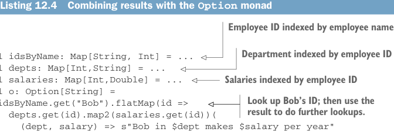

# Page 0347

[<- Page 0346](./page-0346) | [Pages index](./) | [Page 0348 ->](./page-0348)

> Part 3: Common structures in functional design / Chapter 12: Applicative and traversable functors / 12.3 The difference between monads and applicative functors / 12.3.2 The Parser applicative versus the Parser monad

Listing 12.4 Combining results with the `Option` monad



> Employee ID indexed by employee name

> Department indexed by employee ID

```scala
val idsByName: Map[String, Int] = ...
val depts: Map[Int,String] = ...
val salaries: Map[Int,Double] = ...
val o: Option[String] =
idsByName.get("Bob").flatMap(id =>
depts.get(id).map2(salaries.get(id))(
(dept, salary) => s"Bob in $dept makes $salary per year"
)
)
```

> Salaries indexed by employee ID

> Look up Bob’s ID; then use the result to do further lookups.

Here `depts` is a `Map[Int,` `String]` indexed by employee ID, which is an `Int`. If we want to print out Bob’s department and salary, we need to first resolve Bob’s name to his ID and then use this ID to do lookups in `depts` and `salaries`. We might say that with `Applicative`, the structure of our computation is fixed; with `Monad`, the results of previous computations may influence what computations to run next.


Effects in FP Functional programmers often informally call type constructors like `Par`, `Option`, `List`, `Parser`, `Gen`, and so on *effects*. This usage is distinct from the term *side effect*, which implies some violation of referential transparency. These types are called *effects* because they augment ordinary values with extra capabilities. (`Par` adds the ability to define parallel computation, `Option` adds the possibility of failure, and so on.) We sometimes use the terms *monadic effects* or *applicative effects* to mean types with an associated `Monad` or `Applicative` instance.

### 12.3.2 The Parser applicative versus the Parser monad

Let’s look at one more example. Suppose we’re parsing a file of comma-separated values with two columns: *date* and *temperature*. Here’s an example file:

```scala
1/1/2010, 25
2/1/2010, 28
3/1/2010, 42
4/1/2010, 53
...
```

If we know ahead of time that the file will have the *date* and *temperature* columns in that order, we can just encode this order in the `Parser` we construct:

```scala
case class Row(date: Date, temperature: Double)
val d: Parser[Date] = ...
```

[<- Page 0346](./page-0346) | [Pages index](./) | [Page 0348 ->](./page-0348)
