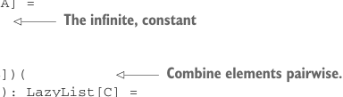
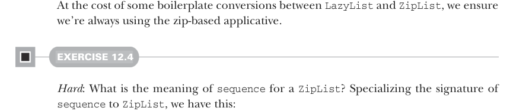

# Page 0350

[<- Page 0349](./page-0349) | [Pages index](./) | [Page 0351 ->](./page-0351)

> Part 3: Common structures in functional design / Chapter 12: Applicative and traversable functors / 12.4 The advantages of applicative functors / 12.4.1 Not all applicative functors are monads

## 321 12.4 The advantages of applicative functors

elements from each input with the function passed to `map2`. Resultingly, the shorter input determines the length of the output. To maintain the structure-preserving property of `map2`, we need an implementation of `unit` that has at least as many elements as any other lazy list. We achieve that by returning an infinite lazy list:

```scala
val zipLazyListApplicative: Applicative[LazyList] = new:
def unit[A](a: => A): LazyList[A] =
LazyList.continually(a)
```



> The infinite, constant

```scala
extension [A](fa: LazyList[A])
def map2[B, C](fb: LazyList[B])(
f: (A, B) => C): LazyList[C] =
fa.zip(fb).map(f.tupled)
```

> Combine elements pairwise.

It’s impossible to define `flatMap` or `join` for this instance in a way that’s compatible with `map2`—that is, in a way in which `fa.map2(fb)(f)` returns the same result as `fa.flatMap(a` `=>` `fb.map(b` `=>` `f(a,` `b))`. We defined this `Applicative[LazyList]` instance as a regular value instead of a given instance since we can only have a single given instance per type (or otherwise introduce ambiguity errors). This works, but it’s a bit cumbersome to use, as we have to explicitly pass it to any operations that take an applicative as a context parameter. Instead, we can introduce a new type and associate it with the zipping applicative using a given instance:

```scala
opaque type ZipList[+A] = LazyList[A]
object ZipList:
def fromLazyList[A](la: LazyList[A]): ZipList[A] = la
extension [A](za: ZipList[A]) def toLazyList: LazyList[A] = za
given zipListApplicative: Applicative[ZipList] with
def unit[A](a: => A): ZipList[A] =
LazyList.continually(a)
extension [A](fa: ZipList[A])
override def map2[B, C](fb: ZipList[B])(f: (A, B) => C) =
fa.zip(fb).map(f.tupled)
```



At the cost of some boilerplate conversions between `LazyList` and `ZipList`, we ensure we’re always using the zip-based applicative.

#### EXERCISE 12.4

*Hard*: What is the meaning of `sequence` for a `ZipList`? Specializing the signature of `sequence` to `ZipList`, we have this:

```scala
def sequence[A](as: List[ZipList[A]]): ZipList[List[A]]
```

[<- Page 0349](./page-0349) | [Pages index](./) | [Page 0351 ->](./page-0351)
