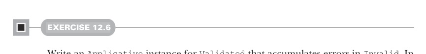

# Page 0352

[<- Page 0351](./page-0351) | [Pages index](./) | [Page 0353 ->](./page-0353)

> Part 3: Common structures in functional design / Chapter 12: Applicative and traversable functors / 12.4 The advantages of applicative functors / 12.4.1 Not all applicative functors are monads

## 323 12.4 The advantages of applicative functors



#### EXERCISE 12.6

Write an `Applicative` instance for `Validated` that accumulates errors in `Invalid`. In chapter 4, we modified the signature of `map2` to take an extra `combineErrors:` `(E,` `E)` `=>` `E` function. In this exercise, use the monoid for the error type to combine errors. Remember that the `summon` method can be used to get an explicit reference to a context parameter:

```scala
given validatedApplicative[E: Monoid]: Applicative[Validated[E, _]] with
def unit[A](a: => A) = ???
extension [A](fa: Validated[E, A])
override def map2[B, C](fb: Validated[E, B])(f: (A, B) => C) =
???
```

To continue the example, consider a web form that requires a name, birth date, and phone number:

```scala
case class WebForm(name: String, birthdate: LocalDate, phoneNumber: String)
```

This data will likely be collected from the user as strings, and we must make sure that the data meets a certain specification. If it doesn’t, we must give a list of errors to the user indicating how to fix the problem. The specification might say that `name` can’t be empty, `birthdate` must be in the `"yyyy-MM-dd"` format, and `phoneNumber` must contain exactly 10 digits.

Listing 12.5 Validating user input in a web form

```scala
def validName(name: String): Validated[List[String], String] =
if name != "" then Validated.Valid(name)
else Validated.Invalid(List("Name cannot be empty"))
def validBirthdate(birthdate: String): Validated[List[String], LocalDate] =
try Validated.Valid(LocalDate.parse(birthdate))
catch case _: java.time.format.DateTimeParseException =>
Validated.Invalid(List("Birthdate must be in the form yyyy-MM-dd"))
def validPhone(phoneNumber: String): Validated[List[String], String] =
if phoneNumber.matches("[0-9]{10}") then Validated.Valid(phoneNumber)
else Validated.Invalid(List("Phone number must be 10 digits"))
```

To validate an entire web form, we can simply lift the `WebForm` constructor with `map3`:

```scala
def validateWebForm(name: String,
birthdate: String,
phone: String): Validated[List[String], WebForm] =
validName(name).map3(
```

[<- Page 0351](./page-0351) | [Pages index](./) | [Page 0353 ->](./page-0353)
