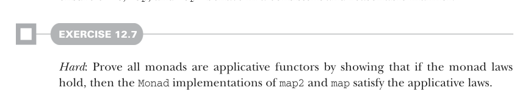
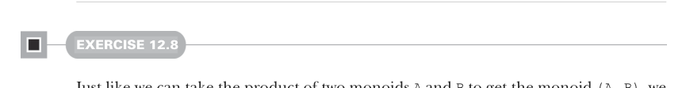

# Page 0357

[<- Page 0356](./page-0356) | [Pages index](./) | [Page 0358 ->](./page-0358)

> Part 3: Common structures in functional design / Chapter 12: Applicative and traversable functors / 12.5 The applicative laws / 12.5.3 Naturality of product

Here we’re applying a transformation to the result of `map2`—from `Employee` we extract the name, and from `Pay` we extract the yearly wage. But we could just as easily apply these transformations separately before calling `format`, giving `format` an `Option[String]` and `Option[Double]` rather than an `Option[Employee]` and `Option[Pay]`. This might be a reasonable refactoring, so `format` doesn’t need to know the details of how the `Employee` and `Pay` data types are represented.

Listing 12.7 Refactoring `format`


```scala
def format(name: Option[String], pay: Option[Double]): Option[String] =
name.map2(pay)((e, p) => s"$e makes $p")
```

> format now takes the employee name as an Option[String] rather than extracting the name from an Option[Employee], and it’s similar for pay.

```scala
val employee: Option[Employee] = ...
val pay: Option[Pay] = ...
format(
employee.map(_.name),
pay.map(p => p.rate * p.hoursPerYear))
```

We’re applying the transformation to extract the `name` and `pay` fields before calling `map2`. We expect this program to have the same meaning as before; this sort of pattern comes up frequently. When working with `Applicative` effects, we generally have the option of applying transformations before or after combining values with `map2`. The naturality law states that it doesn’t matter; we get the same result either way. Stated more formally

```scala
fa.map2(fb)((a, b) => (f(a), g(b))) == fa.map(f).product(fb.map(g))
```

The applicative laws are not surprising or profound. Just like the monad laws, these are simple checks that the applicative functor works in the way we’d expect—they ensure `unit`, `map`, and `map2` behave in a consistent and reasonable manner.



#### EXERCISE 12.7

*Hard*: Prove all monads are applicative functors by showing that if the monad laws hold, then the `Monad` implementations of `map2` and `map` satisfy the applicative laws.



#### EXERCISE 12.8

Just like we can take the product of two monoids `A` and `B` to get the monoid `(A,` `B)`, we can take the product of two applicative functors. Implement this function on the `Applicative` trait:

[<- Page 0356](./page-0356) | [Pages index](./) | [Page 0358 ->](./page-0358)
