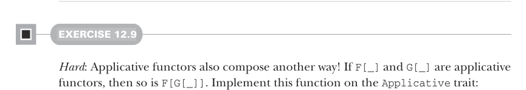
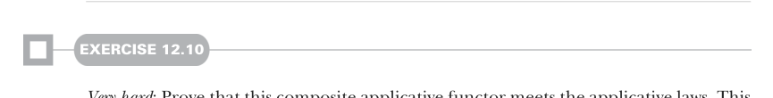
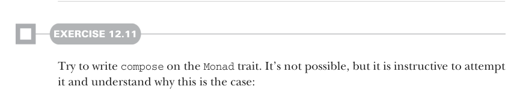

# Page 0358

[<- Page 0357](./page-0357) | [Pages index](./) | [Page 0359 ->](./page-0359)

> Part 3: Common structures in functional design / Chapter 12: Applicative and traversable functors / 12.6 Traversable functors

## 329 12.6 Traversable functors

```scala
trait Applicative[F[_]] extends Functor[F]:
def product[G[_]](G: Applicative[G]): Applicative[[x] =>> (F[x], G[x])] =
???
```



#### EXERCISE 12.9

*Hard*: Applicative functors also compose another way! If `F[_]` and `G[_]` are applicative functors, then so is `F[G[_]]`. Implement this function on the `Applicative` trait:

```scala
trait Applicative[F[_]] extends Functor[F]:
def compose[G[_]](G: Applicative[G]): Applicative[[x] =>> F[G[x]]] =
???
```



#### EXERCISE 12.10

*Very hard*: Prove that this composite applicative functor meets the applicative laws. This is an extremely challenging exercise and is best accomplished via automated proof assistant software.



#### EXERCISE 12.11

Try to write `compose` on the `Monad` trait. It’s not possible, but it is instructive to attempt it and understand why this is the case:

```scala
trait Monad[F[_]] extends Applicative[F]:
def compose[G[_]](G: Monad[G]): Monad[[x] =>> F[G[x]]] =
???
```

### 12.6 Traversable functors

At the start of this chapter, we discovered applicative functors by noticing that our `traverse` and `sequence` functions (and several other operations) didn’t depend directly on `flatMap`. We can spot another abstraction by generalizing `traverse` and `sequence` once again. Look again at the signatures of `traverse` and `sequence`:

```scala
def traverse[F[_], A, B](as: List[A])(f: A => F[B]): F[List[B]]
def sequence[F[_], A](fas: List[F[A]]): F[List[A]]
```

Any time you see a concrete type constructor, like `List` showing up in an abstract interface, like `Applicative`, you may want to ask the question, *What happens if I abstract* *over this type constructor?* Recall from chapter 10 that a number of data types other than

[<- Page 0357](./page-0357) | [Pages index](./) | [Page 0359 ->](./page-0359)
