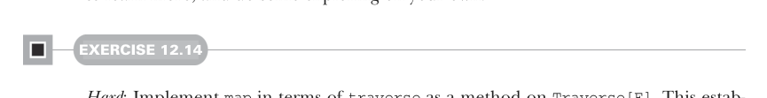

# Page 0360

[<- Page 0359](./page-0359) | [Pages index](./) | [Page 0361 ->](./page-0361)

> Part 3: Common structures in functional design / Chapter 12: Applicative and traversable functors / 12.7 Uses of Traverse

## 331 12.7 Uses of Traverse

 `Tree[Option[A]]` `=>` `Option[Tree[A]]` (a call to `Traverse[Tree].sequence`, with `Option` as the `Applicative`) returns `None` if any of the input `Tree` is `None`; otherwise, it returns a `Some` containing a `Tree` of all the values in the input `Tree`.

 `Map[K,` `Par[A]]` `=>` `Par[Map[K,` `A]]` (a call to `Traverse[Map[K,` `_]].sequence` with `Par` as the `Applicative`) produces a parallel computation that evaluates all values of the map in parallel.

It turns out that there is a startling number of operations that can be defined in the most general possible way in terms of `sequence` and `traverse`. We’ll explore these in the next section. A traversal is similar to a fold in that both take some data structure and apply a function to the data within to produce a result. The difference is that `traverse` preserves the original structure, whereas `foldMap` discards the structure and replaces it with the operations of a monoid. Look at the signature `Tree[Option[A]]` `=>` `Option[Tree[A]]`, for instance. We’re preserving the `Tree` structure, not merely collapsing the values using some monoid.

### 12.7 Uses of Traverse

Let’s now explore the large set of operations that can be implemented quite generally using `Traverse`. We’ll only scratch the surface here; if you’re interested, follow some of the references in the chapter notes (https://github.com/fpinscala/fpinscala/wiki) to learn more, and do some exploring on your own.



#### EXERCISE 12.14

*Hard*: Implement `map` in terms of `traverse` as a method on `Traverse[F]`. This establishes that `Traverse` is an extension of `Functor` and the `traverse` function is a generalization of `map` (for this reason, we sometimes call these *traversable functors*). Note that when implementing `map`, you can call `traverse` with your choice of `Applicative[G]`:

```scala
trait Traverse[F[_]] extends Functor[F]:
extension [A](fa: F[A])
def traverse[G[_]: Applicative, B](f: A => G[B]): G[F[B]] =
fa.map(f).sequence
def map[B](f: A => B): F[B] = ???
extension [G[_]: Applicative, A](fga: F[G[A]])
def sequence: G[F[A]] =
fga.traverse(ga => ga)
```

But what is the relationship between `Traverse` and `Foldable`? The answer involves a connection between `Applicative` and `Monoid`.

[<- Page 0359](./page-0359) | [Pages index](./) | [Page 0361 ->](./page-0361)
