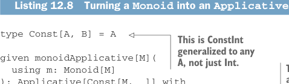
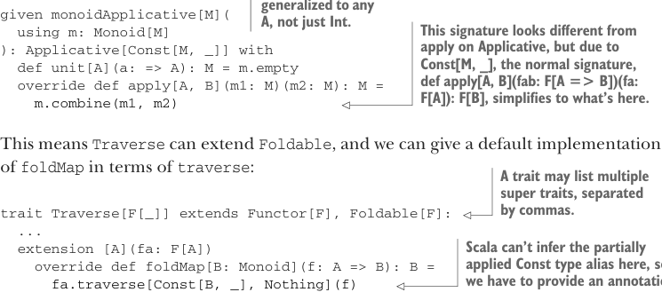

# Page 0361

[<- Page 0360](./page-0360) | [Pages index](./) | [Page 0362 ->](./page-0362)

> Part 3: Common structures in functional design / Chapter 12: Applicative and traversable functors / 12.7 Uses of Traverse / 12.7.1 From monoids to applicative functors

### 12.7.1 From monoids to applicative functors

We’ve just learned that `traverse` is more general than `map`. Next we’ll learn that `traverse` can also express `foldMap` and, by extension, `foldLeft` and `foldRight`! Take another look at the signature of `traverse`:

```scala
extension [A](fa: F[A])
def traverse[G[_]: Applicative, B](f: A => G[B]): G[F[B]]
```

Suppose that our `G` is a type constructor `ConstInt` that takes any type to `Int`, so `ConstInt[A]` throws away its type argument `A` and just gives us `Int`:

```scala
type ConstInt[A] = Int
```

Then, in the type signature for `traverse`, if we instantiate `G` to be `ConstInt`, it becomes

```scala
extension [A](fa: F[A])
def traverse(f: A => Int): Int
```

This looks a lot like `foldMap` from `Foldable`. Indeed, if `F` is something like `List`, then to implement this signature, we need a way of combining the `Int` values returned by `f` for each element of the list and a starting value for handling the empty list. In other words, we only need a `Monoid[Int]`, and that’s easy to come by. In fact, given a constant functor like we have here, we can turn any `Monoid` into an `Applicative`.



Listing 12.8 Turning a `Monoid` into an `Applicative`

```scala
type Const[A, B] = A
```

> This is ConstInt generalized to any A, not just Int. This signature looks different from apply on Applicative, but due to Const[M, _], the normal signature, def apply[A, B](fab: F[A => B])(fa: F[A]): F[B], simplifies to what’s here.



```scala
given monoidApplicative[M](
using m: Monoid[M]
): Applicative[Const[M, _]] with
def unit[A](a: => A): M = m.empty
override def apply[A, B](m1: M)(m2: M): M =
m.combine(m1, m2)
```

This means `Traverse` can extend `Foldable`, and we can give a default implementation of `foldMap` in terms of `traverse`:

> A trait may list multiple super traits, separated by commas.

```scala
trait Traverse[F[_]] extends Functor[F], Foldable[F]:
...
extension [A](fa: F[A])
override def foldMap[B: Monoid](f: A => B): B =
```

> Scala can’t infer the partially applied Const type alias here, so we have to provide an annotation.

```scala
fa.traverse[Const[B, _], Nothing](f)
```

`Traverse` now extends both `Foldable` and `Functor`! Importantly, `Foldable` itself can’t extend `Functor`. Even though it’s possible to write `map` in terms of a fold for most foldable data structures, like `List`, it’s not possible in general.

[<- Page 0360](./page-0360) | [Pages index](./) | [Page 0362 ->](./page-0362)
