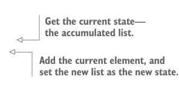

# Page 0362

[<- Page 0361](./page-0361) | [Pages index](./) | [Page 0363 ->](./page-0363)

> Part 3: Common structures in functional design / Chapter 12: Applicative and traversable functors / 12.7 Uses of Traverse / 12.7.2 Traversals with State

## 333 12.7 Uses of Traverse


#### EXERCISE 12.15

Answer, to your own satisfaction, the question of why it’s not possible for `Foldable` to extend `Functor`. Can you think of a `Foldable` that isn’t a functor?

So what is `Traverse` really for? We’ve already seen practical applications of particular instances, such as turning a list of parsers into a parser that produces a list, but in what kinds of cases do we want the generalization? What sort of generalized library does `Traverse` allow us to write?

### 12.7.2 Traversals with State

The `State` applicative functor is a particularly powerful one. Using a `State` action to `traverse` a collection, we can implement complex traversals that keep some kind of internal state. To demonstrate, here’s a `State` traversal that labels every element with its position. We keep an integer state, starting with 0, and add 1 at each step. Note that this implementation depends on a given instance of `Applicative[State[S,` `_]]` being available.

Listing 12.9 Numbering the elements in a traversable

```scala
extension [A](fa: F[A])
def zipWithIndex: F[(A, Int)] =
fa.traverse(a =>
for
i <- State.get[Int]
_ <- State.set(i + 1)
yield (a, i)
).run(0)(0)
```

This definition works for `List`, `Tree`, or any other traversable. Continuing along these lines, we can keep a state of type `List[A]` to turn any traversable functor into a `List`.

Listing 12.10 Turning traversable functors into lists

```scala
extension [A](fa: F[A])
def toList: List[A] =
fa.traverse(a =>
for
as <- State.get[List[A]]
_
<- State.set(a :: as)
yield ()
).run(Nil)(1).reverse
```



> Get the current state— the accumulated list.

> Add the current element, and set the new list as the new state.

[<- Page 0361](./page-0361) | [Pages index](./) | [Page 0363 ->](./page-0363)
