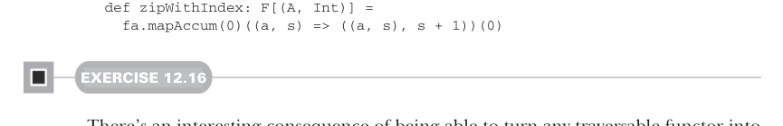
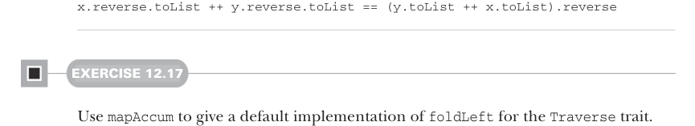

# Page 0363

[<- Page 0362](./page-0362) | [Pages index](./) | [Page 0364 ->](./page-0364)

> Part 3: Common structures in functional design / Chapter 12: Applicative and traversable functors / 12.7 Uses of Traverse / 12.7.2 Traversals with State

We begin with the empty list `Nil` as the initial state, and at every element in the traversal, we add it to the front of the accumulated list. This will construct the list in the reverse order of the traversal, so we end by reversing the list we get from running the completed state action. Note that we `yield` `()` because in this instance, we don’t want to return any value other than the state. Notice that the code for `toList` and `zipWithIndex` is nearly identical. And in fact, most traversals with `State` will follow this exact pattern: we get the current state, compute the next state, set it, and yield some value. We should capture that in a function.

Listing 12.11 Factoring out our `mapAccum` function

```scala
extension [A](fa: F[A])
def mapAccum[S, B](s: S)(f: (A, S) => (B, S)): (F[B], S) =
fa.traverse(a =>
for
s1 <- State.get[S]
(b, s2) = f(a, s1)
_
<- State.set(s2)
yield b
).run(s)
override def toList: List[A] =
fa.mapAccum(List[A]())((a, s) => ((), a :: s))(1).reverse
```



```scala
def zipWithIndex: F[(A, Int)] =
fa.mapAccum(0)((a, s) => ((a, s), s + 1))(0)
```

#### EXERCISE 12.16

There’s an interesting consequence of being able to turn any traversable functor into a reversed list: we can write, once and for all, a function to reverse any traversable functor! Write this function, and think about what it means for `List`, `Tree`, and other traversable functors:

```scala
extension [A](fa: F[A])
def reverse: F[A]
```

It should obey the following law for all `x` and `y` of the appropriate types:



```scala
x.reverse.toList ++ y.reverse.toList == (y.toList ++ x.toList).reverse
```

#### EXERCISE 12.17

Use `mapAccum` to give a default implementation of `foldLeft` for the `Traverse` trait.

[<- Page 0362](./page-0362) | [Pages index](./) | [Page 0364 ->](./page-0364)
