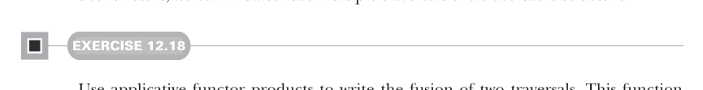

# Page 0365

[<- Page 0364](./page-0364) | [Pages index](./) | [Page 0366 ->](./page-0366)

> Part 3: Common structures in functional design / Chapter 12: Applicative and traversable functors / 12.7 Uses of Traverse / 12.7.6 Monad composition

### 12.7.4 Traversal fusion

In chapter 5, we talked about how multiple passes over a structure can be fused into one. In chapter 10, we looked at how we can use monoid products to carry out multiple computations over a foldable structure in a single pass. Using products of applicative functors, we can likewise fuse multiple traversals of a traversable structure.



#### EXERCISE 12.18

Use applicative functor products to write the fusion of two traversals. This function will, given two functions `f` and `g`, traverse `fa` a single time, collecting the results of both functions at once. Define this as an extension method on the `Traverse` trait:

```scala
extension [A](fa: F[A])
def fuse[M[_]: Applicative, N[_]: Applicative, B](
f: A => M[B], g: A => N[B]
): (M[F[B]], N[F[B]])
```

### 12.7.5 Nested traversals

Not only can we use composed applicative functors to fuse traversals, traversable functors themselves compose. If we have a nested structure, like `Map[K,` `Option[List[V]]]`, then we can traverse the map, the option, and the list at the same time and easily get to the `V` value inside because `Map`, `Option`, and `List` are all traversable.


#### EXERCISE 12.19

Implement the composition of two `Traverse` instances. Define this as a method on the `Traverse` trait:

```scala
def compose[G[_]: Traverse]: Traverse[[x] =>> F[G[x]]] = ???
```

### 12.7.6 Monad composition

Let’s now return to the problem of composing monads. As we saw earlier in this chapter, `Applicative` instances always compose, but `Monad` instances do not. If you tried to implement general monad composition earlier, then you would have found that to implement `join` for nested monads `F` and `G`, you’d have to write something of a type like `F[G[F[G[A]]]]` `=>` `F[G[A]]`—and that can’t be written generally. But if `G` also happens to have a `Traverse` instance, then we can `sequence` to turn `G[F[_]]` into `F[G[_]]`, leading to `F[F[G[G[A]]]]`. Then we can join the adjacent `F` as well as `G` layers, using their respective `Monad` instances.

[<- Page 0364](./page-0364) | [Pages index](./) | [Page 0366 ->](./page-0366)
