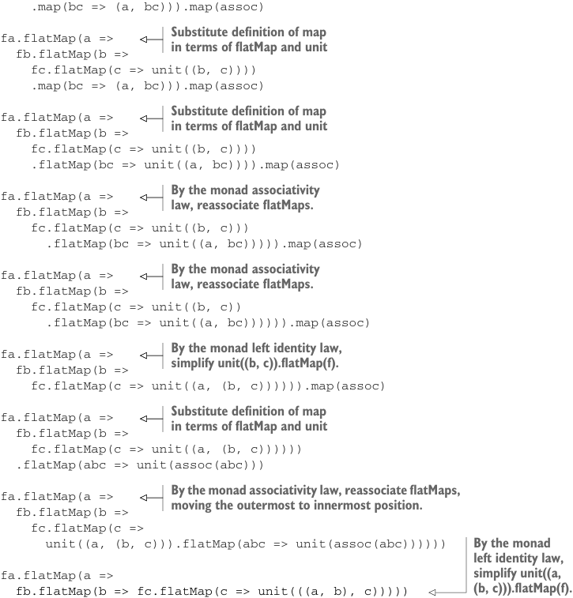

# Page 0373

[<- Page 0372](./page-0372) | [Pages index](./) | [Page 0374 ->](./page-0374)

> Part 3: Common structures in functional design / Chapter 12: Applicative and traversable functors / 12.9 Exercise answers



```scala
.map(bc => (a, bc))).map(assoc)
```

> Substitute definition of map in terms of flatMap and unit

```scala
fa.flatMap(a =>
fb.flatMap(b =>
fc.flatMap(c => unit((b, c))))
.map(bc => (a, bc))).map(assoc)
```

> Substitute definition of map in terms of flatMap and unit

```scala
fa.flatMap(a =>
fb.flatMap(b =>
fc.flatMap(c => unit((b, c))))
.flatMap(bc => unit((a, bc)))).map(assoc)
```

> By the monad associativity law, reassociate flatMaps.

```scala
fa.flatMap(a =>
fb.flatMap(b =>
fc.flatMap(c => unit((b, c)))
.flatMap(bc => unit((a, bc))))).map(assoc)
```

> By the monad associativity law, reassociate flatMaps.

```scala
fa.flatMap(a =>
fb.flatMap(b =>
fc.flatMap(c => unit((b, c))
.flatMap(bc => unit((a, bc)))))).map(assoc)
```

> By the monad left identity law, simplify unit((b, c)).flatMap(f).

```scala
fa.flatMap(a =>
fb.flatMap(b =>
fc.flatMap(c => unit((a, (b, c)))))).map(assoc)
```

> Substitute definition of map in terms of flatMap and unit

```scala
fa.flatMap(a =>
fb.flatMap(b =>
fc.flatMap(c => unit((a, (b, c))))))
.flatMap(abc => unit(assoc(abc)))
```


> By the monad associativity law, reassociate flatMaps, moving the outermost to innermost position.

```scala
fa.flatMap(a =>
fb.flatMap(b =>
fc.flatMap(c =>
unit((a, (b, c))).flatMap(abc => unit(assoc(abc))))))
```

> By the monad left identity law, simplify unit((a, (b, c))).flatMap(f).

```scala
fa.flatMap(a =>
fb.flatMap(b => fc.flatMap(c => unit(((a, b), c)))))
```

The following is the proof of naturality; let’s start with the definition of the naturality law:

```scala
fa.map2(fb)((a, b) => (f(a), g(b))) == fa.map(f).product(fb.map(g))
```


> The left-hand side of the naturality law Substitute definition of map2 in terms of flatMap and map

Now let’s simplify the left-hand side:

```scala
fa.map2(fb)((a, b) => (f(a), g(b)))
fa.flatMap(a => fb.map(b => (f(a), g(b))))
```

Then let’s simplify the right-hand side:

> The right-hand side of the naturality law

```scala
fa.map(f).product(fb.map(g))
```

> Substitute definition of product in terms of map2

```scala
fa.map(f).map2(fb.map(g))((_, _))
```

[<- Page 0372](./page-0372) | [Pages index](./) | [Page 0374 ->](./page-0374)
