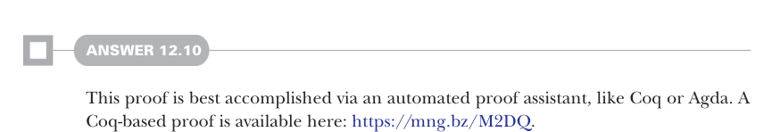
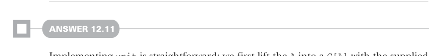
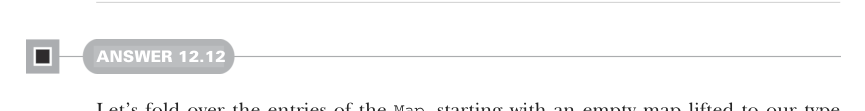

# Page 0375

[<- Page 0374](./page-0374) | [Pages index](./) | [Page 0376 ->](./page-0376)

> Part 3: Common structures in functional design / Chapter 12: Applicative and traversable functors / 12.9 Exercise answers



#### ANSWER 12.10

This proof is best accomplished via an automated proof assistant, like Coq or Agda. A Coq-based proof is available here: https://mng.bz/M2DQ.



#### ANSWER 12.11

Implementing `unit` is straightforward; we first lift the `A` into a `G[A]` with the supplied `Monad[G]` and then lift the result to `F[G[A]]` with the `Monad[F]`. Unfortunately, it isn’t possible to implement `flatMap`. We need to eventually get at the `A` value to apply it to our function `f`. No matter which way we get at it, we end up with types that don’t quite fit together. In the following example, we `flatMap` the outer `F[G[A]]` and then map the inner `G[A]`, but we’re left with a type that doesn’t work with our existing combinators— a `G[F[G[B]]]`:


> It doesn’t compile because G.map(ga)(a => f(a)) returns G[F[G[B]]], but self.flatMap needs F on the outside.

```scala
trait Monad[F[_]] extends Applicative[F]:
self =>
def compose[G[_]](G: Monad[G]): Monad[[x] =>> F[G[x]]] = new:
def unit[A](a: => A): F[G[A]] = self.unit(G.unit(a))
extension [A](fga: F[G[A]])
override def flatMap[B](f: A => F[G[B]]): F[G[B]] =
self.flatMap(fga)(ga => G.map(ga)(a => f(a)))
```

We could `flatMap` the inner `G` instead—`self.flatMap(fga)(ga` `=>` `G.flatMap(ga)(a` `=>` `f(a)))`—but again we end up with `F` and `G` in the wrong position with no way to swap. `f(a)` returns a `F[G[B]]`, but `G.flatMap` demands `G` on the outside. If we could somehow swap the positions of `F` and `G`, we’d have a solution—more on that later.



#### ANSWER 12.12

Let’s fold over the entries of the `Map`, starting with an empty map lifted to our type constructor via `unit`. On each iteration, we use `map2` to combine the entry value of type `F[V]` with the accumulator of type `Map[K,` `V]`, yielding a new map with one new entry:

```scala
def sequenceMap[K, V](ofv: Map[K, F[V]]): F[Map[K, V]] =
ofv.foldLeft(unit(Map.empty[K, V])):
case (acc, (k, fv)) =>
acc.map2(fv)((m, v) => m + (k -> v))
```

[<- Page 0374](./page-0374) | [Pages index](./) | [Page 0376 ->](./page-0376)
