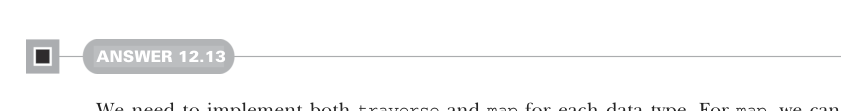

# Page 0376

[<- Page 0375](./page-0375) | [Pages index](./) | [Page 0377 ->](./page-0377)

> Part 3: Common structures in functional design / Chapter 12: Applicative and traversable functors / 12.9 Exercise answers

## 347 12.9 Exercise answers



#### ANSWER 12.13

We need to implement both `traverse` and `map` for each data type. For `map`, we can reuse the `map` operation on these data types. To implement the `List` instance, let’s use a right fold that uses `map2` to cons each element onto the accumulated output list. The initial accumulator is an empty list lifted into `G` via the `unit` of the `Applicative[G]` instance:

```scala
given listTraverse: Traverse[List] with
extension [A](as: List[A])
override def traverse[G[_]: Applicative, B](f: A => G[B]): G[List[B]] =
val g = summon[Applicative[G]]
as.foldRight(g.unit(List[B]()))((a, acc) => f(a).map2(acc)(_ :: _))
def map[B](f: A => B): List[B] =
as.map(f)
```

The `Option` instance is implemented by pattern matching on the original optional. If it’s a `Some(a)`, we invoke `f(a)` and map the `Some` constructor over the result, converting `G[B]` to `G[Option[B]]`. If instead the original option is a `None`, then we lift `None` into `G` via the `unit` operation of the `Applicative[G]`:

```scala
given optionTraverse: Traverse[Option] with
extension [A](oa: Option[A])
override def traverse[G[_]: Applicative, B](
f: A => G[B]
): G[Option[B]] =
oa match
case Some(a) => f(a).map(Some(_))
case None
=> summon[Applicative[G]].unit(None)
def map[B](f: A => B): Option[B] =
oa.map(f)
```

The `Tree` instance is a little bit different due to branching recursion. We immediately invoke `f` with the head value, which gives us a `G[B]`. We then traverse the tail list of subtree and recursively traverse each of them, which gives us a `G[List[B]]`. We use `map2` to combine the head `G[B]` and subtree `G[List[B]]` into a single `G[Tree[B]]`:

```scala
given treeTraverse: Traverse[Tree] = new:
extension [A](ta: Tree[A])
override def traverse[G[_]: Applicative, B](f: A => G[B]): G[Tree[B]] =
f(ta.head).map2(ta.tail.traverse(a => a.traverse(f)))(Tree(_, _))
def map[B](f: A => B): Tree[B] =
Tree(f(ta.head), ta.tail.map(_.map(f)))
```

Finally, the instance for a `Map[K,` `_]` is implemented with a left fold, starting with an empty `Map[K,` `B]` lifted into `G` via the `unit` of `Applicative[G]`. For each entry in the original map of type `(K,` `A)`, we call the supplied function with the entry value. This leaves

[<- Page 0375](./page-0375) | [Pages index](./) | [Page 0377 ->](./page-0377)
