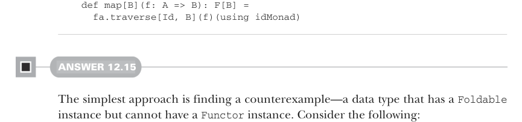
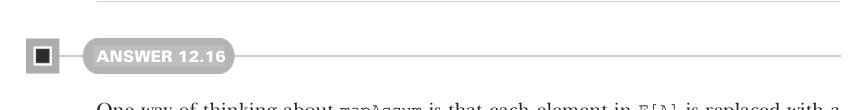

# Page 0378

[<- Page 0377](./page-0377) | [Pages index](./) | [Page 0379 ->](./page-0379)

> Part 3: Common structures in functional design / Chapter 12: Applicative and traversable functors / 12.9 Exercise answers

## 349 12.9 Exercise answers

```scala
fa.map(f).sequence
```



```scala
def map[B](f: A => B): F[B] =
fa.traverse[Id, B](f)(using idMonad)
```

#### ANSWER 12.15

The simplest approach is finding a counterexample—a data type that has a `Foldable` instance but cannot have a `Functor` instance. Consider the following:

```scala
case class Iteration[A](a: A, f: A => A, n: Int)
```

This type has a lawful `Foldable` instance:

```scala
given iterationFoldable: Foldable[Iteration] with
extension [A](i: Iteration[A])
override def foldMap[B](g: A => B)(using m: Monoid[B]): B =
def iterate(n: Int, b: B, c: A): B =
if n <= 0 then b else iterate(n - 1, g(c), i.f(i.a))
iterate(i.n, m.empty, i.a)
```

When we try to implement `Functor[Iteration]`, we run into a problem:

```scala
given iterationFunctor: Functor[Iteration] with
extension [A](i: Iteration[A])
def map[B](g: A => B): Iteration[B] =
Iteration(g(i.a), b => ???, i.n)
```

The types guide us into needing to implement a function `B` `=>` `B`, but we only have functions `i.f:` `A` `=>` `A` and `g:` `A` `=>` `B`. There’s no way of putting these functions together to implement `B` `=>` `B`. One way of thinking about this is that `Foldable` lets us visit each element, whereas `Functor` lets us change elements while preserving the overall structure. However, `Foldable` doesn’t let us construct new values of the foldable type.



#### ANSWER 12.16

One way of thinking about `mapAccum` is that each element in `F[A]` is replaced with a transformed element of `B` (resulting in an `F[B]`), but unlike `map`, the computation depends on an accumulated state. With this model, `reverse` becomes a matter of replacing the element with its corresponding element in its reversal at the same position. We implement this by converting the input `F[A]` to a list, reversing that list, and doing a `mapAccum` traversal. On each element, we discard the input `A` and replace it with the head of the remaining reversed list, returning the tail of the remaining

[<- Page 0377](./page-0377) | [Pages index](./) | [Page 0379 ->](./page-0379)
