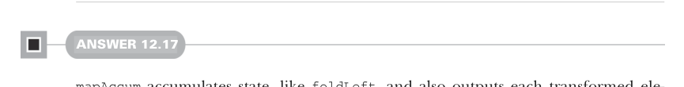
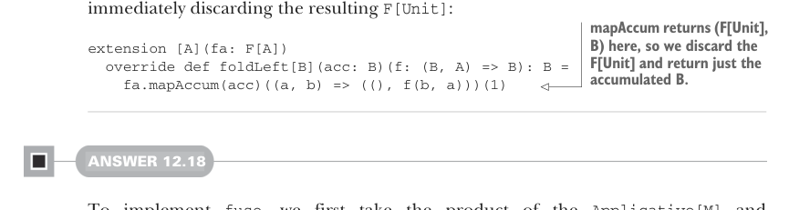

# Page 0379

[<- Page 0378](./page-0378) | [Pages index](./) | [Page 0380 ->](./page-0380)

> Part 3: Common structures in functional design / Chapter 12: Applicative and traversable functors / 12.9 Exercise answers

reversed list for the next element. When the traversal completes, the state is an empty list, which we discard:

```scala
extension [A](fa: F[A])
def reverse: F[A] =
fa.mapAccum(fa.toList.reverse)((_, as) => (as.head, as.tail))(0)
```



#### ANSWER 12.17

`mapAccum` accumulates state, like `foldLeft`, and also outputs each transformed element, unlike `foldLeft`. To implement `foldLeft` in terms of `mapAccum`, we use the state accumulation feature and discard the accumulated transformed elements. Because we’re only using the final accumulated state, we return `()` for each transformed element, though we could have returned anything, really—`a`, `0`, `true`, and so on. We’re immediately discarding the resulting `F[Unit]`:



> mapAccum returns (F[Unit], B) here, so we discard the F[Unit] and return just the accumulated B.

```scala
extension [A](fa: F[A])
override def foldLeft[B](acc: B)(f: (B, A) => B): B =
fa.mapAccum(acc)((a, b) => ((), f(b, a)))(1)
```

#### ANSWER 12.18

To implement `fuse`, we first take the product of the `Applicative[M]` and `Applicative[N]` instances, and then we traverse the original input, applying each element to both `f` and `g` and pairing the result. We have to be explicit about the type of applicative used in the traversal; otherwise, Scala infers a different type constructor:

```scala
extension [A](fa: F[A])
def fuse[M[_], N[_], B](
f: A => M[B], g: A => N[B])(using m: Applicative[M], n: Applicative[N]
): (M[F[B]], N[F[B]]) =
fa.traverse[[x] =>> (M[x], N[x]), B](a =>
(f(a), g(a)))(using m.product(n))
```


#### ANSWER 12.19

We first traverse the `F[G[A]]` with an anonymous function that receives a `G[A]`. In that anonymous function, we then traverse the `G[A]` with the supplied function `f`, resulting in an `H[G[B]]`. Consequently, the outer traversal has the type `H[F[G[B]]]`:

```scala
def compose[G[_]: Traverse]: Traverse[[x] =>> F[G[x]]] = new:
extension [A](fga: F[G[A]])
```

[<- Page 0378](./page-0378) | [Pages index](./) | [Page 0380 ->](./page-0380)
