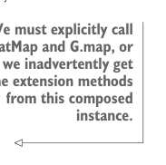

# Page 0380

[<- Page 0379](./page-0379) | [Pages index](./) | [Page 0381 ->](./page-0381)

> Part 3: Common structures in functional design / Chapter 12: Applicative and traversable functors / 12.9 Exercise answers

## 351 12.9 Exercise answers


```scala
override def traverse[H[_]: Applicative, B](f: A => H[B]): H[F[G[B]]] =
self.traverse(fga)(ga => ga.traverse(f))
```

#### ANSWER 12.20

The `unit` operation is straightforward: lift the value into `H` and then into `G`, resulting in a `G[H[A]]`. The `flatMap` operation is more challenging. We first `flatMap` the `gha:` `G[H[A]]`, which means we have to implement an anonymous function that receives an `H[A]`. We `traverse` that `H[A]` with the supplied function `f`, resulting in a value of `G[H[H[B]]]`. We then map over that and `join` the inner `H` layers into a single `H` layer:



> We must explicitly call G.flatMap and G.map, or else we inadvertently get the extension methods from this composed instance.

```scala
def composeM[G[_], H[_]](
using G: Monad[G], H: Monad[H], T: Traverse[H]
): Monad[[x] =>> G[H[x]]] = new:
def unit[A](a: => A): G[H[A]] = G.unit(H.unit(a))
extension [A](gha: G[H[A]])
override def flatMap[B](f: A => G[H[B]]): G[H[B]] =
G.flatMap(gha)(ha => G.map(T.traverse(ha)(f))(H.join))
```

[<- Page 0379](./page-0379) | [Pages index](./) | [Page 0381 ->](./page-0381)
