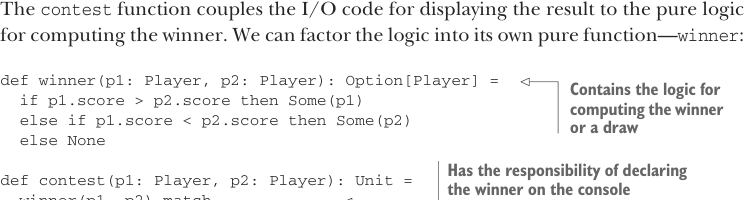

# Page 0385

[<- Page 0384](./page-0384) | [Pages index](./) | [Page 0386 ->](./page-0386)

> Part 4: Effects and I/O / Chapter 13: External effects and I/O / 13.1 Factoring effects

programming. This is a powerful technique we’ll use throughout the rest of part 4. Our goal is equipping you with the skills needed to craft your own EDSLs for describing effectful programs.

### 13.1 Factoring effects

We’ll work our way up to the `IO` monad by first considering a simple example of a program with side effects.

Listing 13.1 Program with side effects

```scala
case class Player(name: String, score: Int)
def contest(p1: Player, p2: Player): Unit =
if p1.score > p2.score then
println(s"${p1.name} is the winner!")
else if p2.score > p1.score then
println(s"${p2.name} is the winner!")
else
println("It's a draw.")
```

The `contest` function couples the I/O code for displaying the result to the pure logic for computing the winner. We can factor the logic into its own pure function—`winner`:



```scala
def winner(p1: Player, p2: Player): Option[Player] =
if p1.score > p2.score then Some(p1)
else if p1.score < p2.score then Some(p2)
else None
```

> Contains the logic for computing the winner or a draw


> Has the responsibility of declaring the winner on the console

```scala
def contest(p1: Player, p2: Player): Unit =
winner(p1, p2) match
case Some(Player(name, _)) => println(s"$name is the winner!")
case None => println("It's a draw.")
```

It is always possible to factor an impure procedure into a pure core function and two procedures with side effects: one that supplies the pure function’s input and one that does something with the pure function’s output. In listing 13.1, we factored the pure function `winner` out of `contest`. Conceptually, contest had two responsibilities: computing the result of the contest and displaying the computed result. With the refactored code, `winner` has a single responsibility: computing the winner. The `contest` method retains the responsibility of printing the result of `winner` to the console. We can refactor this even further. The `contest` function still has two responsibilities: computing which message to display and then printing that message to the console. We could factor out a pure function here as well, which might be beneficial if we later decide to display the result in some sort of UI or write it to a file instead. Let’s perform this refactoring now:

[<- Page 0384](./page-0384) | [Pages index](./) | [Page 0386 ->](./page-0386)
