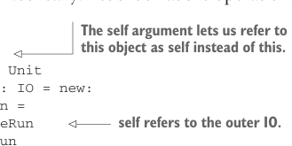

# Page 0387

[<- Page 0386](./page-0386) | [Pages index](./) | [Page 0388 ->](./page-0388)

> Part 4: Effects and I/O / Chapter 13: External effects and I/O / 13.2 A simple IO type / 13.2.1 Handling input effects

is composing the parts of the program together: `winner` to compute who the winner is, `winnerMsg` to compute what the resulting message should be, and `PrintLine` to indicate that the message should be printed to the console. But the responsibility of interpreting the effect and manipulating the console is held by the `run` method on `IO`. Other than technically satisfying the requirements of referential transparency, has the `IO` type actually bought us anything? That’s a personal value judgment. As with any other data type, we can assess the merits of `IO` by considering what sort of algebra it provides— is it something interesting, from which we can define a large number of useful operations and programs, with nice laws that give us the ability to reason about what these larger programs will do? Not really. Let’s look at the operations we can define:



> The self argument lets us refer to this object as self instead of this.

```scala
trait IO:
self =>
def unsafeRun: Unit
def ++(io: IO): IO = new:
def unsafeRun =
self.unsafeRun
io.unsafeRun
```

> self refers to the outer IO.

```scala
object IO:
def empty: IO = new:
def unsafeRun = ()
```

The only thing we can perhaps say about `IO` as it stands is that it forms a `Monoid` (`empty` is the identity, and `++` is the associative operation). So if we have, for example, a `List[IO]`, we can reduce that to a single `IO`, and the associativity of `++` means we can do this either by folding left or right. On its own, this isn’t very interesting. All it seems to have given us is the ability to delay when a side effect occurs. Now we’ll let you in on a secret: you, as the programmer, get to invent whatever API you wish to represent your computations, including those that interact with the universe external to your program. This process of crafting pleasing, useful, and composable descriptions of what you want your programs to do is, at its core, *language* *design*. You’re crafting a little language and an associated interpreter that will allow you to express various programs. If you don’t like something about the language you’ve created, change it! You should approach this like any other design task.

### 13.2.1 Handling input effects

As you’ve seen before, sometimes when building up a little language, you’ll encounter a program that it can’t express. So far, our `IO` type can represent only output effects. There’s no way of expressing `IO` computations that must, at various points, wait for input from some external source. Suppose we want to write a program that prompts the user for a temperature in degrees Fahrenheit and then converts this value to Celsius and echoes it to the user. A typical imperative program might look something like the following listing.2

2 We’re not doing any sort of error handling here. This is just meant to be an illustrative example.

[<- Page 0386](./page-0386) | [Pages index](./) | [Page 0388 ->](./page-0388)
