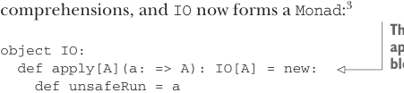

# Page 0388

[<- Page 0387](./page-0387) | [Pages index](./) | [Page 0389 ->](./page-0389)

> Part 4: Effects and I/O / Chapter 13: External effects and I/O / 13.2 A simple IO type / 13.2.1 Handling input effects

## 359 13.2 A simple IO type

Listing 13.2 Imperative program that converts Fahrenheit to Celsius

```scala
def fahrenheitToCelsius(f: Double): Double =
(f - 32) * 5.0/9.0
def converter: Unit =
println("Enter a temperature in degrees Fahrenheit: ")
val d = readLine.toDouble
println(fahrenheitToCelsius(d))
```

Unfortunately, we run into problems if we want to make `converter` into a pure function that returns an `IO`:

```scala
def fahrenheitToCelsius(f: Double): Double =
(f - 32) * 5.0/9.0
def converter: IO =
val prompt: IO =
PrintLine("Enter a temperature in degrees Fahrenheit: ")
// now what ???
```

In Scala, `readLine` is a `def` with the side effect of capturing a line of input from the console; it returns a `String`. We could wrap a call to `readLine` in `IO`, but we have nowhere to put the result! We don’t yet have a way of representing this sort of effect. The problem is that our current I/O type can’t express computations that yield a value of some meaningful type—our interpreter of `IO` just produces `Unit` as its output. Should we give up on our `IO` type and resort to using side effects? Of course not! We extend our `IO` type to allow input by adding a type parameter:

```scala
trait IO[A]:
self =>
def unsafeRun: A
def map[B](f: A => B): IO[B] = new:
def unsafeRun = f(self.unsafeRun)
def flatMap[B](f: A => IO[B]): IO[B] = new:
def unsafeRun = f(self.unsafeRun).unsafeRun
```

An `IO` computation can now return a meaningful value by returning an `A` from `unsafeRun`. We’ve added `map` and `flatMap` functions here, so `IO` can be used in forcomprehensions, and `IO` now forms a `Monad`:3



> This method lets us use the function application syntax to construct IO blocks, as in IO(…).

```scala
object IO:
def apply[A](a: => A): IO[A] = new:
def unsafeRun = a
given monad: Monad[IO] with
```

3 We’re using the `Monad` type from chapter 11 here, but in the companion GitHub repository, we define the `Monad` trait anew in the package corresponding to this chapter, as we’ll add a number of combinators throughout this chapter.

[<- Page 0387](./page-0387) | [Pages index](./) | [Page 0389 ->](./page-0389)
