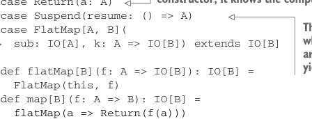
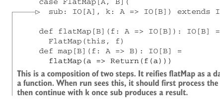
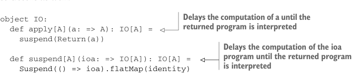

# Page 0393

[<- Page 0392](./page-0392) | [Pages index](./) | [Page 0394 ->](./page-0394)

> Part 4: Effects and I/O / Chapter 13: External effects and I/O / 13.3 Avoiding the StackOverflowError / 13.3.1 Reifying control flow as data constructors

data type. For example, instead of making `flatMap` a method that constructs a new `IO` in terms of `unsafeRun`, we can just make it a data constructor of the IO data type, and then the interpreter can be a tail-recursive loop. Whenever it encounters a constructor like `FlatMap(x,` `k)`, it will interpret `x`, and then it will call `k` on the result. Here’s a new `IO` type that implements that idea.

Listing 13.4 Creating a new `IO` type


> This is a pure computation that immediately returns an A without any further steps. When unsafeRun sees this constructor, it knows the computation has finished.

```scala
enum IO[A]:
case Return(a: A)
case Suspend(resume: () => A)
case FlatMap[A, B](
sub: IO[A], k: A => IO[B]) extends IO[B]
```



> This is a suspension of the computation, where resume is a function that takes no arguments but has some effect and yields a result.



```scala
def flatMap[B](f: A => IO[B]): IO[B] =
FlatMap(this, f)
def map[B](f: A => B): IO[B] =
flatMap(a => Return(f(a)))
```

> This is a composition of two steps. It reifies flatMap as a data constructor rather than a function. When run sees this, it should first process the subcomputation sub and then continue with k once sub produces a result.

This new `IO` type has three data constructors, representing the three different kinds of control flow we want the interpreter of this data type to support. `Return` represents an `IO` action that has finished, meaning we want to return the value `a`, without any further steps. `Suspend` means we want to execute some effect to produce a result, and the `FlatMap` data constructor lets us extend or continue an existing computation by using the result of the first computation to produce a second computation. The `flatMap` method’s implementation can now simply call the `FlatMap` data constructor and return immediately. When the interpreter encounters `FlatMap(sub,` `k)`, it can interpret the subcomputation `sub` and then remember to call the continuation `k` on the result. Then `k` will continue executing the program. Let’s add some convenience constructors as well:



> Delays the computation of a until the returned program is interpreted

```scala
object IO:
def apply[A](a: => A): IO[A] =
suspend(Return(a))
```

> Delays the computation of the ioa program until the returned program is interpreted

```scala
def suspend[A](ioa: => IO[A]): IO[A] =
Suspend(() => ioa).flatMap(identity)
```

Note that the definitions of `apply` and `suspend` do not evaluate their by-name arguments—rather, evaluation is delayed until later, when the thunk passed to the internal `Suspend` value is forced. We’ll get to the interpreter shortly, but first let’s rewrite our `printLine` example to use this new `IO` type:

[<- Page 0392](./page-0392) | [Pages index](./) | [Page 0394 ->](./page-0394)
