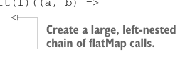
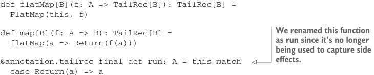

# Page 0396

[<- Page 0395](./page-0395) | [Pages index](./) | [Page 0397 ->](./page-0397)

> Part 4: Effects and I/O / Chapter 13: External effects and I/O / 13.3 Avoiding the StackOverflowError / 13.3.2 Trampolining: A general solution to stack overflow

## 367 13.3 Avoiding the StackOverflowError

```scala
scala> val g = List.fill(10000)(f).foldLeft(f)((a, b) =>
|
x => IO.suspend(a(x).flatMap(b))
val g: Int => IO[Int] = <function1>
```



> Create a large, left-nested chain of flatMap calls.

```scala
scala> val x1 = g(0).unsafeRun()
val x1: Int = 0
scala> val x2 = g(42).unsafeRun()
val x2: Int = 42
```

But there’s no I/O going on here at all. So `IO` is a bit of a misnomer. It really gets that name from the fact that `Suspend` can contain a side-effecting function. But what we have is not really a monad for I/O—it’s actually a monad for tail-call elimination! Let’s change its name to reflect that:

```scala
enum TailRec[A]:
case Return(a: A)
case Suspend(resume: () => A)
case FlatMap[A,B](sub: TailRec[A],
k: A => TailRec[B]) extends TailRec[B]
def flatMap[B](f: A => TailRec[B]): TailRec[B] =
FlatMap(this, f)
```



> We renamed this function as run since it’s no longer being used to capture side effects.

```scala
def map[B](f: A => B): TailRec[B] =
flatMap(a => Return(f(a)))
@annotation.tailrec final def run: A = this match
case Return(a) => a
case Suspend(r) => r()
case FlatMap(x, f) => x match
case Return(a) => f(a).run
case Suspend(r) => f(r()).run
case FlatMap(y, g) => y.flatMap(a => g(a).flatMap(f)).run
```

We can use the `TailRec` data type to add trampolining to any function type `A` `=>` `B` by modifying the return type `B` to `TailRec[B]` instead. We just saw an example where we changed a program that used `Int` `=>` `Int` to use `Int` `=>` `TailRec[Int]`. The program just had to be modified to use `flatMap` in function composition8 and `Suspend` before every function call. Using `TailRec` can be slower than direct function calls, but its advantage is that we gain predictable stack usage.9

8 This is the Kleisli composition from chapter 11. In other words, the trampolined function uses the Kleisli composition in the `TailRec` monad instead of ordinary function composition. 9 When we use TailRec to implement tail calls that wouldn’t be otherwise optimized, it’s faster than using direct calls (not to mention stack safe). It seems the overhead of building and tearing down stack frames is greater than the overhead of having all calls wrapped in a `Suspend`. There are variations on `TailRec` that we haven’t investigated in detail—it isn’t necessary to transfer control to the central loop after every function call, only periodically for avoiding stack overflows. We can, for example, implement the same basic idea using exceptions. See `Throw.scala` in the chapter code.

[<- Page 0395](./page-0395) | [Pages index](./) | [Page 0397 ->](./page-0397)
