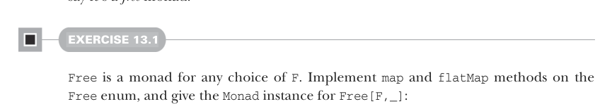
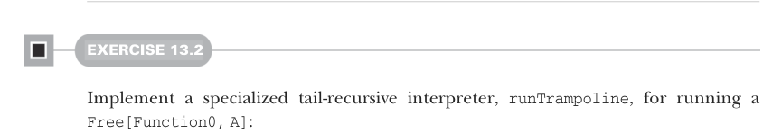
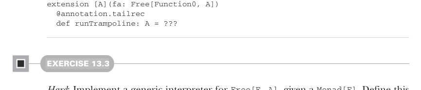

# Page 0399

[<- Page 0398](./page-0398) | [Pages index](./) | [Page 0400 ->](./page-0400)

> Part 4: Effects and I/O / Chapter 13: External effects and I/O / 13.4 A more nuanced I/O type / 13.4.1 Free monads

### 13.4.1 Free monads

The `Return` and `FlatMap` constructors witness that this data type is a monad for any choice of* *`F`, and since they’re exactly the operations required to generate a monad, we say it’s a *free* monad.10



#### EXERCISE 13.1

`Free` is a monad for any choice of `F`. Implement `map` and `flatMap` methods on the `Free` enum, and give the `Monad` instance for `Free[F,_]`:

```scala
given freeMonad[F[_]]: Monad[[x] =>> Free[F, x]] with
def unit[A](a: => A): Free[F, A] = ???
extension [A](fa: Free[F, A])
def flatMap[B](f: A => Free[F, B]): Free[F, B] = ???
```



#### EXERCISE 13.2

Implement a specialized tail-recursive interpreter, `runTrampoline`, for running a `Free[Function0,` `A]`:



```scala
extension [A](fa: Free[Function0, A])
@annotation.tailrec
def runTrampoline: A = ???
```

#### EXERCISE 13.3

*Hard*: Implement a generic interpreter for `Free[F,` `A]`, given a `Monad[F]`. Define this interpreter as a method on the `Free` type. You can pattern your implementation after the `Async` interpreter given previously, including using a tail-recursive `step` function:

```scala
enum Free[F[_], A]:
...
def run(using F: Monad[F]): F[A] = ???
@annotation.tailrec
final def step: Free[F, A] = ???
```

10 In this context *free* means *generated freely* in the sense that `F` doesn’t need to have any monadic structure of its own. See the chapter notes (https://github.com/fpinscala/fpinscala/wiki) for a more formal statement of the definition of free.

[<- Page 0398](./page-0398) | [Pages index](./) | [Page 0400 ->](./page-0400)
