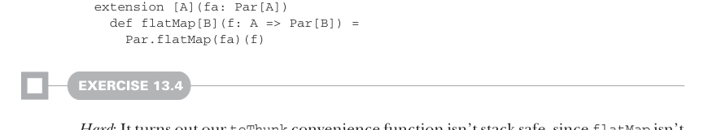
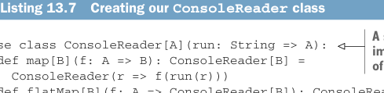

# Page 0404

[<- Page 0403](./page-0403) | [Pages index](./) | [Page 0405 ->](./page-0405)

> Part 4: Effects and I/O / Chapter 13: External effects and I/O / 13.4 A more nuanced I/O type / 13.4.3 Pure interpreters

## 375 13.4 A more nuanced I/O type



```scala
extension [A](fa: Par[A])
def flatMap[B](f: A => Par[B]) =
Par.flatMap(fa)(f)
```

#### EXERCISE 13.4

*Hard*: It turns out our `toThunk` convenience function isn’t stack safe, since `flatMap` isn’t stack safe for `Function0` (it has the same problem as our original, naive `IO` type in which `unsafeRun` called itself in the implementation of `flatMap`). Implement `translate` using `runFree`, and then use `translate` to implement `unsafeRunConsole` in a stack-safe manner:

```scala
enum Free[F[_], A]:
...
def translate[G[_]](fToG: [x] => F[x] => G[x]): Free[G, A] = ???
extension [A](fa: Free[Console, A])
def unsafeRunConsole: A = ???
```

A value of the `Free[F,` `A]` type is like a program written in an instruction set provided by `F`. In the case of `Console`, the two instructions are `PrintLine` and `ReadLine`. The recursive scaffolding (`Suspend`) and monadic variable substitution (`FlatMap` and `Return`) are provided by `Free` itself. We can introduce other choices of `F` for different instruction sets—for example, different I/O capabilities, such as a file system, `F`, granting read/write access (or even just read access) to the file system. Or we could have a network `F` granting the ability to open network connections and read from them, and so on.

### 13.4.3 Pure interpreters

Note that nothing about the `Free[Console,` `A]` type implies that any effects must actually occur! That decision is the responsibility of the interpreter. We could choose to translate our `Console` actions into pure values that perform no I/O at all! For example, an interpreter for testing purposes could ignore `PrintLine` requests and always return a constant string in response to `ReadLine` requests. We would do this by translating our `Console` requests to a `String` `=>` `A`, which forms a monad in `A`, as we saw in exercise 11.20 (`readerMonad`).

Listing 13.7 Creating our `ConsoleReader` class



> A specialized reader monad, implemented as a case class, instead of an opaque type, for brevity

```scala
case class ConsoleReader[A](run: String => A):
def map[B](f: A => B): ConsoleReader[B] =
ConsoleReader(r => f(run(r)))
def flatMap[B](f: A => ConsoleReader[B]): ConsoleReader[B] =
ConsoleReader(r => f(run(r)).run(r))
```

[<- Page 0403](./page-0403) | [Pages index](./) | [Page 0405 ->](./page-0405)
