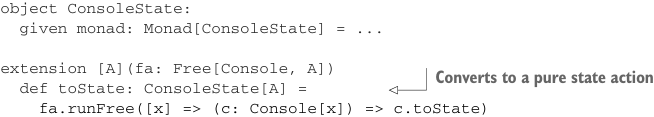

# Page 0405

[<- Page 0404](./page-0404) | [Pages index](./) | [Page 0406 ->](./page-0406)

> Part 4: Effects and I/O / Chapter 13: External effects and I/O / 13.4 A more nuanced I/O type / 13.4.3 Pure interpreters

```scala
object ConsoleReader:
given monad: Monad[ConsoleReader] with
def unit[A](a: => A) = ConsoleReader(_ => a)
extension [A](fa: ConsoleReader[A])
def flatMap[B](f: A => ConsoleReader[B]) = fa.flatMap(f)
```

We introduce another function on `Console`, `toReader`, and then use that to implement `toReader` for a `Free[Console,` `A]`:

```scala
enum Console[A]:
...
def toReader: ConsoleReader[A]
extension [A](fa: Free[Console, A])
def toReader: ConsoleReader[A] =
fa.runFree([x] => (c: Console[x]) => c.toReader)
```

Or for a more complete simulation of console I/O, we could write an interpreter that uses two lists—one to represent the input buffer and another to represent the output buffer. When the interpreter encounters a `ReadLine`, it can pop an element off the input buffer, and when it encounters a `PrintLine(s)`, it can push `s` onto the output buffer:


> This represents a pair of buffers. The in buffer will be fed to ReadLine requests, and the out buffer will receive strings contained in PrintLine requests.

```scala
enum Console[A]:
...
def toState: ConsoleState[A]
case class Buffers(in: List[String], out: List[String])
case class ConsoleState[A](
run: Buffers => (A, Buffers))
```


> A specialized state action

```scala
object ConsoleState:
given monad: Monad[ConsoleState] = ...
```



```scala
extension [A](fa: Free[Console, A])
def toState: ConsoleState[A] =
```

> Converts to a pure state action

```scala
fa.runFree([x] => (c: Console[x]) => c.toState)
```

This will allow us to have multiple interpreters for our little languages! We could, for example, use `toState` for testing console applications with our property-based testing library from chapter 8 and then use `unsafeRunConsole` to actually run our program.13

The fact that we can write a generic `runFree` that turns `Free` programs into `State` or `Reader` values demonstrates something amazing: there’s nothing about our `Free` type that requires side effects of any kind. For example, from the perspective of our

13 Note that `toReader` and `toState` aren’t stack safe as implemented for the same reason `toThunk` wasn’t stack safe. We can fix this by changing the representations to `String => TailRec[A]` for `ConsoleReader` and `Buffers => TailRec[(A, Buffers)]` for `ConsoleState`.

[<- Page 0404](./page-0404) | [Pages index](./) | [Page 0406 ->](./page-0406)
