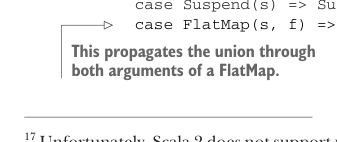

# Page 0409

[<- Page 0408](./page-0408) | [Pages index](./) | [Page 0410 ->](./page-0410)

> Part 4: Effects and I/O / Chapter 13: External effects and I/O / 13.5 Non-blocking and asynchronous I/O / 13.5.1 Composing free algebras

console, or perform any other effects. Its expressive power is limited to sequencing the operations defined in `Files`. Using this approach, we can systematically turn any set of I/O operations into an algebraic data type and then use `Free` to represent programs consisting of sequences of those primitive operations. Let’s try writing a `cat` utility, which reads the lines from a file and prints them to the console:

```scala
def cat(file: String) =
Files.readLines(file).flatMap: lines =>
Console.printLn(lines.mkString("\n"))
```

Unfortunately, this doesn’t compile! Scala reports an error like the following:

```scala
-- [E007] Type Mismatch Error: ------------------------------------------
|
Console.printLn(lines.mkString("\n"))
|
^^^^^^^^^^^^^^^^^^^^^^^^^^^^^^^^^^^^^
|
Found:
Free[Console, Unit]
|
Required: Free[Files, B]
|
|
where:
B is a type variable with constraint
```

What’s going on here? `Files.readLines(file)` returns a `Free[Files,` `List[String]]`. We `flatMap` that value and try to return a `Free[Console,` `Unit]`. Scala complains because a `Free[Console,` `Unit]` can’t be unified with a `Free[Files,` `B]` for some arbitrary type `B`. In essence, `Files` and `Console` are different algebras, and we can’t just mix and match them. Let’s think about the type we want Scala to infer for `cat`. We want a program that can use operations from either `Console` or `Files`. We can use Scala 3’s union types to represent this notion.17 Let’s create a type constructor that represents the union of the operations from `Console` and `Files`—that is, `[x]` `=>>` `Console[x]` `|` `Files[x]`. The return type of `cat` then becomes `Free[[x]` `=>` `Console[x]` `|` `Files[x],` `Unit]`. Now that we know the desired type, how can we implement it? Let’s add a method to `Free` that lets us convert a `Free[F,` `A]` to a `Free[[x]` `=>>` `F[x]` `|` `G[x],` `A]` for an arbitrary `G[_]`:

```scala
enum Free[F[_], A]:
...
def union[G[_]]: Free[[x] =>> F[x] | G[x], A] = this match
case Return(a) => Return(a)
case Suspend(s) => Suspend(s: F[A] | G[A])
case FlatMap(s, f) => FlatMap(s.union, a => f(a).union)
```


> s has the type F[A], so we can ascribe the type F[A] | G[A].



> This propagates the union through both arguments of a FlatMap.

17 Unfortunately, Scala 2 does not support union types, which makes composing algebras much clunkier. A popular technique is representing the composed algebra as a *coproduct* of the individual algebras. This typically requires a lot of boilerplate to manage conversions between individual algebras and coproduct algebras.

[<- Page 0408](./page-0408) | [Pages index](./) | [Page 0410 ->](./page-0410)
