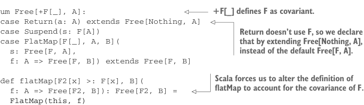

# Page 0410

[<- Page 0409](./page-0409) | [Pages index](./) | [Page 0411 ->](./page-0411)

> Part 4: Effects and I/O / Chapter 13: External effects and I/O / 13.5 Non-blocking and asynchronous I/O / 13.5.1 Composing free algebras

## 381 13.5 Non-blocking and asynchronous I/O

The magic happens in the case of `Suspend`, where we lift `s:` `F[A]` to a value of `F[A]` `|` `G[A]`. Given a union type `X` `|` `Y`, values of `X` and `Y` are inhabitants of that type. Here we’re taking `X` `=` `F[A]` and `Y` `=` `G[A]`. The `union` method gives us the ability to express `cat`:

```scala
def cat(file: String) =
Files.readLines(file).union[Console].flatMap: lines =>
Console.printLn(lines.mkString("\n")).union[Files]
```

This is a lot of syntax. Every free expression needs to be manually converted to the proper type via `union`; we can do better. Notice how we were able to implement `union` for every `Free[F,` `A]`, without any constraints on `F` or `G`. This tells us that a `Free[F,` `A]` can be used anywhere we expect a `Free[[x]` `=>>` `F[x]` `|` `G[x],` `A]`—that a value of the former is always convertible to a value of the latter. We can use covariance to declare this equivalence to Scala, removing the need to manually insert calls to `union`:



> +F[_] defines F as covariant.

```scala
enum Free[+F[_], A]:
case Return(a: A) extends Free[Nothing, A]
case Suspend(s: F[A])
case FlatMap[F[_], A, B](
s: Free[F, A],
f: A => Free[F, B]) extends Free[F, B]
```

> Return doesn’t use F, so we declare that by extending Free[Nothing, A], instead of the default Free[F, A].

> Scala forces us to alter the definition of flatMap to account for the covariance of F.

```scala
def flatMap[F2[x] >: F[x], B](
f: A => Free[F2, B]): Free[F2, B] =
FlatMap(this, f)
```

By declaring `Free` to be covariant in its type parameter `F`, `Free[G,` `A]` is a subtype of `Free[H,` `A]` if `G` is a subtype of `H`. This, in turn, means a `Free[Console,` `A]` is a subtype of `Free[[x]` `=>>` `Console[x]` `|` `Files[x]]` as a result of `Console` being a subtype of `[x]` `=>>` `Console[x]` `|` `Files[x]`. What happened to the signature of `flatMap`? If we make no changes, Scala complains with an error:

```scala
|
def flatMap[B](f: A => Free[F, B]): Free[F, B] =
|
^^^^^^^^^^^^^^^^^^
|covariant type F occurs in contravariant position
|in type A => Free[F, B] of parameter f
```

We’re trying to use `F` unsoundly here—roughly, as a result of the variance of `Free` and `Function1`, a caller of `flatMap` may return a `Free[G,` `B]`, where `G` is a supertype of `F`. Yet our type signature claims it returns a `Free[F,` `B]` in that case. Scala forces us to be more explicit about this possibility. The new signature says the function may return a `Free[F2,` `B]`, where `F2` is a supertype of `F`. The overall result ends up being a `Free` `[F2,` `B]` instead of `Free[F,` `B]`. If this seems confusing, that’s because it is! Understanding variance and subtyping takes significant effort and practice. The good news is that we can often mechanically

[<- Page 0409](./page-0409) | [Pages index](./) | [Page 0411 ->](./page-0411)
