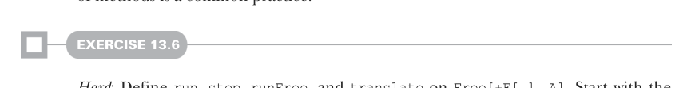

# Page 0411

[<- Page 0410](./page-0410) | [Pages index](./) | [Page 0412 ->](./page-0412)

> Part 4: Effects and I/O / Chapter 13: External effects and I/O / 13.5 Non-blocking and asynchronous I/O / 13.5.1 Composing free algebras

transform definitions to account for variance. When making a type parameter covariant, we replace each contravariant usage (as reported by the compiler) with a new type parameter that’s a supertype of the covariant type parameter. In the case of `flatMap`, Scala reported that `F` was used in a contravariant position, so we introduced a type param, `F2[x]` `>:` `F[x]`, and replaced the contravariant use of `F` with `F2`. With this new formulation of `Free`, `union` becomes much simpler:

```scala
enum Free[+F[_], A]:
...
def union[G[_]]: Free[[x] =>> F[x] | G[x], A] = this
```

We can even generalize `union` to a new operation, which lets us specify an explicit type for `F`, without having to repeat the full type of the expression:

```scala
enum Free[+F[_], A]:
...
def covary[F2[x] >: F[x]]: Free[F2, A] = this
```

The `covary` operation doesn’t provide any new functionality—it’s simply syntactic sugar. For any value `fa:` `Free[F,` `A]` and type `F2[x]` `>:` `F[x]`, `fa.covary[F2]` can always be written as `fa:` `Free[F2,` `A]` instead. Both `covary` and `union` end up providing subtle hints about Scala’s type inference, rather than introducing new functionality. Let’s now return to `cat`—this new definition of `Free` lets us compose free programs in the `Files` and `Console` algebras with little boilerplate:

```scala
def cat(file: String): Free[[x] =>> Files[x] | Console[x], Unit] =
Files.readLines(file).flatMap: lines =>
Console.printLn(lines.mkString("\n"))
```

We must explicitly provide a type for the `cat` definition, as Scala won’t infer the union type automatically. This isn’t a bad trade-off though, as explicitly defining return types of methods is a common practice.



#### EXERCISE 13.6

*Hard*: Define `run`, `step`, `runFree`, and `translate` on `Free[+F[_],` `A]`. Start with the definitions from the invariant encoding, and alter type signatures and implementations to account for the covariance of `F`.

Now that we have a `Free[[x]` `=>>` `Files[x]` `|` `Console[x],` `Unit]`, how do we run it? We use `runFree` just like before, but we pattern match on the effect and dispatch to an effect-specific conversion to our target monad:

[<- Page 0410](./page-0410) | [Pages index](./) | [Page 0412 ->](./page-0412)
