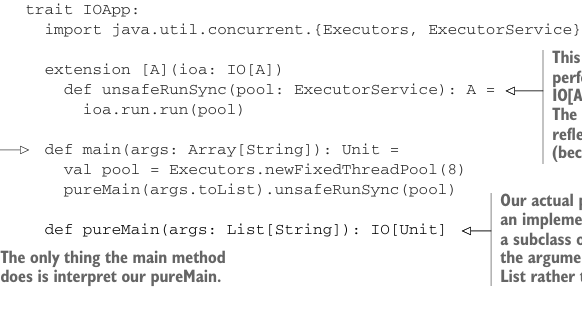

# Page 0415

[<- Page 0414](./page-0414) | [Pages index](./) | [Page 0416 ->](./page-0416)

> Part 4: Effects and I/O / Chapter 13: External effects and I/O / 13.8 Why the IO type is insufficient for streaming I/O

### 13.7.1 The main program at the end of the universe

When the JVM calls into our main program, it expects a `main` method with a specific signature. The return type of this method is `Unit`, meaning it’s expected to have some side effects. But we can delegate to a `pureMain` program that’s entirely pure! The only thing the `main` method does in that case is interpret our pure program, actually performing the effects.

Listing 13.8 Turning side effects into just effects



```scala
trait IOApp:
import java.util.concurrent.{Executors, ExecutorService}
```

> This interprets the IO action and performs the effect by turning IO[A] into Par[A] and then A. The name of this method reflects that it’s unsafe to call (because it has side effects).

```scala
extension [A](ioa: IO[A])
def unsafeRunSync(pool: ExecutorService): A =
ioa.run.run(pool)
def main(args: Array[String]): Unit =
val pool = Executors.newFixedThreadPool(8)
pureMain(args.toList).unsafeRunSync(pool)
```

> Our actual program goes here as an implementation of pureMain in a subclass of IOApp. It also takes the arguments as an immutable List rather than a mutable Array.

```scala
def pureMain(args: List[String]): IO[Unit]
```

> The only thing the main method does is interpret our pureMain.

We want to make a distinction here between effects and side effects. The `pureMain` program itself isn’t going to have any side effects; it should be a referentially transparent expression of the `IO[Unit]` type. Performing effects is entirely contained within `main`, which is outside the universe of our actual program, `pureMain`. Since our program can’t observe these effects occurring, but they nevertheless occur, we say our program has effects but not side effects.

### 13.8 Why the IO type is insufficient for streaming I/O

Despite the flexibility of the `IO` monad and the advantage of having I/O actions as first-class values, the `IO` type fundamentally provides us with the same level of abstraction as ordinary imperative programming. This means that writing efficient, streaming I/O will generally involve monolithic loops. Let’s look at an example. Suppose we wanted to write a program to convert a file, fahrenheit.txt, containing a sequence of temperatures in degrees Fahrenheit, separated by line breaks, to a new file, `celsius.txt`, containing the same temperatures in degrees Celsius:21

```scala
trait Files[F[_]]:
def readLines(file: String): F[List[String]]
def writeLines(file: String, lines: List[String]): F[Unit]
```

21 We’re ignoring exception handling in this example.

[<- Page 0414](./page-0414) | [Pages index](./) | [Page 0416 ->](./page-0416)
