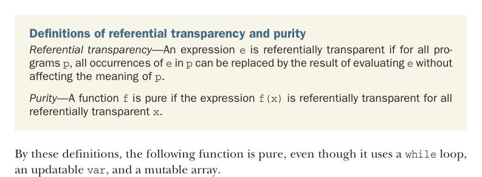
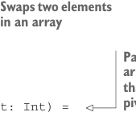

# Page 0424

[<- Page 0423](./page-0423) | [Pages index](./) | [Page 0425 ->](./page-0425)

> Part 4: Effects and I/O / Chapter 14: Local effects and mutable state / 14.1 Purely functional mutable state

## 395 14.1 Purely functional mutable state

### 14.1 Purely functional mutable state

Up until this point, you may have had the impression that in purely functional programming you’re not allowed to use mutable state. But if we look carefully, there’s nothing about the definitions of referential transparency and purity that disallows mutation of local state. Let’s refer to our definitions from chapter 1.



Definitions of referential transparency and purity *Referential transparency*—An expression `e` is referentially transparent if for all programs `p`, all occurrences of `e` in `p` can be replaced by the result of evaluating `e` without affecting the meaning of `p`.

*Purity*—A function `f` is pure if the expression `f(x)` is referentially transparent for all referentially transparent `x`.

By these definitions, the following function is pure, even though it uses a `while` loop, an updatable `var`, and a mutable array.

Listing 14.1 In-place `quicksort` with a mutable array

```scala
def quicksort(xs: List[Int]): List[Int] =
if xs.isEmpty then xs
else
val arr = xs.toArray
```


> Swaps two elements in an array



```scala
def swap(x: Int, y: Int) =
val tmp = arr(x)
arr(x) = arr(y)
arr(y) = tmp
```

> Partitions a portion of the array into elements less than and greater than pivot, respectively

```scala
def partition(n: Int, r: Int, pivot: Int) =
val pivotVal = arr(pivot)
swap(pivot, r)
var j = n
for i <- n until r if arr(i) < pivotVal do
swap(i, j)
j += 1
swap(j, r)
j
```

> Sorts a portion of the array in place

```scala
def qs(n: Int, r: Int): Unit =
if n < r then
val pi = partition(n, r, n + (n - r) / 2)
qs(n, pi - 1)
qs(pi + 1, r)
qs(0, arr.length - 1)
arr.toList
```

[<- Page 0423](./page-0423) | [Pages index](./) | [Page 0425 ->](./page-0425)
