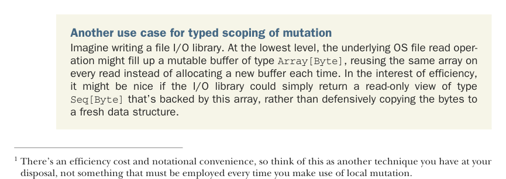

# Page 0426

[<- Page 0425](./page-0425) | [Pages index](./) | [Page 0427 ->](./page-0427)

> Part 4: Effects and I/O / Chapter 14: Local effects and mutable state / 14.2 A data type to enforce the scoping of side effects / 14.2.1 A little language for scoped mutation

## 397 14.2 A data type to enforce the scoping of side effects

There’s nothing wrong with doing this sort of loose reasoning to determine the scoping of side effects, but it’s sometimes desirable to enforce effect scoping using Scala’s type system. The constituent parts of `quicksort` would have direct side effects if used on their own, and with the types we’re using, we get no help controlling the scope of these side effects from the compiler. Additionally, we aren’t alerted if we accidentally leak side effects or mutable state to a broader scope than intended. In this section, we’ll develop a data type that uses Scala’s type system to enforce the scoping of mutations.1

Note that we could just work in `IO`, but that’s really not appropriate for local mutable state. If `quicksort` returned `IO[List[Int]]`, then it would be an `IO` action that’s perfectly safe to run and would have no side effects, which isn’t the case for arbitrary `IO` actions in general. We want to be able to distinguish between effects that are safe to run (like locally mutable state) and external effects like I/O, so a new data type is in order.

### 14.2.1 A little language for scoped mutation

The most natural approach is making a little language for talking about mutable state. Writing and reading a state is something we can already do with the `State[S,` `A]` monad, which you’ll recall is just a function of type `S` `=>` `(A,` `S)` that takes an input state and produces a result and an output state. However, when we’re talking about mutating the state in place, we’re not really passing it from one action to the next. Instead, we’ll pass a kind of token marked with the type `S`. A function called with the token then has the authority to mutate data that’s tagged with the same type `S`. This new data type will employ Scala’s type system to gain two static guarantees. We want our code to not compile if it violates these invariants:

If we hold a reference to a mutable object, then nothing can observe us mutating it.

A mutable object can never be observed outside of the scope in which it was created.

We relied on the first invariant for our implementation of `quicksort`—we mutated an array, but since no one else had a reference to that array, the mutation wasn’t observable outside our function definition. The second invariant is more subtle; it’s saying we won’t leak references to any mutable state as long as that mutable state remains in scope. This invariant is important for some use cases (see the sidebar).

Another use case for typed scoping of mutation Imagine writing a file I/O library. At the lowest level, the underlying OS file read operation might fill up a mutable buffer of type `Array[Byte]`, reusing the same array on every read instead of allocating a new buffer each time. In the interest of efficiency, it might be nice if the I/O library could simply return a read-only view of type `Seq[Byte]` that’s backed by this array, rather than defensively copying the bytes to a fresh data structure.

1 There’s an efficiency cost and notational convenience, so think of this as another technique you have at your disposal, not something that must be employed every time you make use of local mutation.

[<- Page 0425](./page-0425) | [Pages index](./) | [Page 0427 ->](./page-0427)
